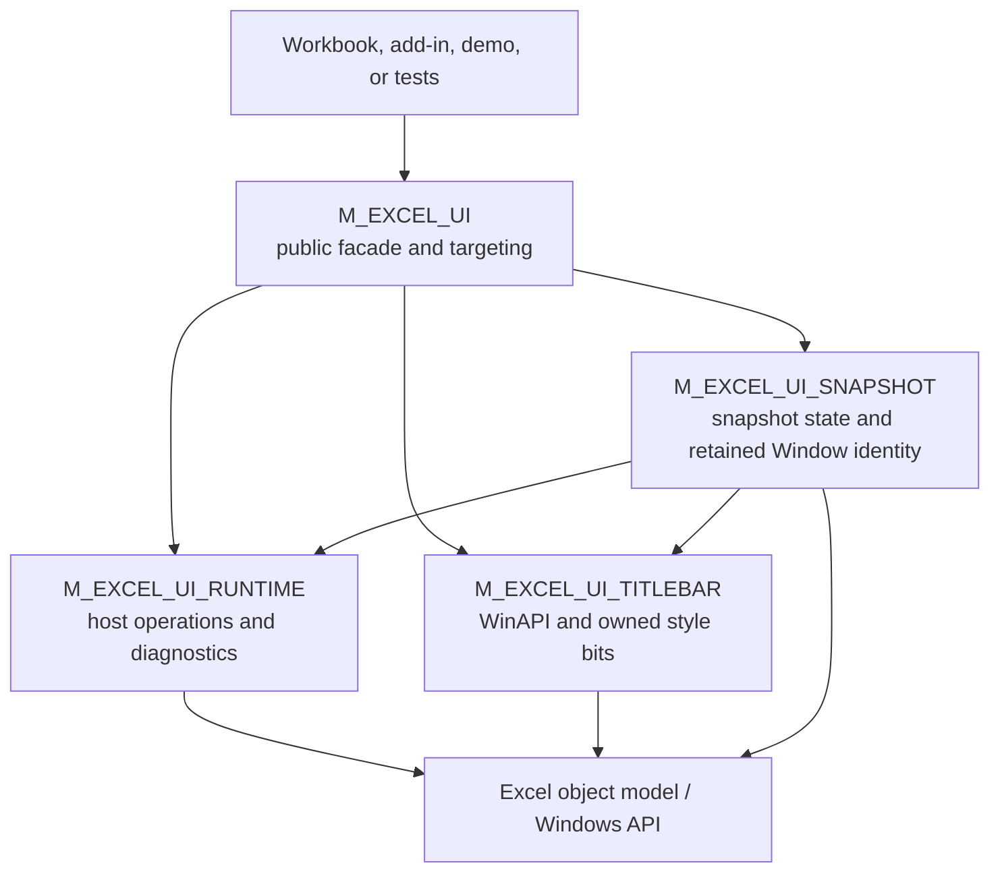

<div align="center">

# 🪟 VBA Excel UI

### A structured Windows Excel UI controller for application-style workbooks

**Tri-state visibility control · Targeted window scopes · Best-effort execution · Structured diagnostics · Identity-safe snapshot restore · Owned-bit title-bar management · Modular architecture**

<br>

[](https://github.com/danielep71/VBA-EXCEL_UI)
[](#requirements)
[](#public-api)
[](INSTALLATION.md)
[](#status)

<br>

[](https://github.com/danielep71/VBA-EXCEL_UI/releases)
[](LICENSE)
[](https://github.com/danielep71/VBA-EXCEL_UI/issues)

<br>

**No installer · No COM add-in · No third-party DLL · No non-standard VBA reference**

[Installation](INSTALLATION.md)
&nbsp;·&nbsp;
[Quick start](#quick-start)
&nbsp;·&nbsp;
[Public API](#public-api)
&nbsp;·&nbsp;
[Target scopes](#target-scopes)
&nbsp;·&nbsp;
[Architecture](#architecture)
&nbsp;·&nbsp;
[Regression tests](#regression-testing)
&nbsp;·&nbsp;
[Download demo release assets](https://github.com/danielep71/VBA-EXCEL_UI/releases)

---

<p align="center">
  
</p>

---

</div>

---

> [!IMPORTANT]
> This component ships as a **four-module production package**. Importing only
> `M_EXCEL_UI.bas` is not a valid installation. See [INSTALLATION.md](INSTALLATION.md).

> [!NOTE]
> The macro-enabled demo workbook is **not versioned in the repository**.
> Tested `.xlsm` demo builds are distributed only as GitHub Release assets.

## ✨ What this project is

**VBA Excel UI** is a focused VBA component for controlling the visible Excel shell on Windows.

It provides one stable project-facing API for:

- showing, hiding, or leaving unchanged individual Excel UI elements;
- applying application-level and window-level settings consistently;
- targeting all Excel windows, only the active window, or all windows of the active workbook;
- controlling the Excel title bar through bitness-safe WinAPI calls;
- capturing and restoring an in-memory UI baseline;
- restoring each captured Excel window by retained object identity rather than collection index;
- returning ordered structured diagnostics;
- maintaining a deterministic show-all emergency recovery path.

The public API remains concentrated in `M_EXCEL_UI`. Internal responsibilities are separated into private project modules for runtime services, snapshot state, and title-bar handling.

---

<a id="managed-ui-surface"></a>

## 🎚️ Managed UI surface

| UI element | Scope | Mechanism | Targetable |
|---|---|---|:---:|
| Ribbon | **Active window** | Ribbon command with best-effort state reads | No |
| Status Bar | Excel application | `Application.DisplayStatusBar` | No |
| Scroll Bars | Excel application | `Application.DisplayScrollBars` | No |
| Formula Bar | Excel application | `Application.DisplayFormulaBar` | No |
| Headings | Excel window | `Window.DisplayHeadings` | Yes |
| Workbook Tabs | Excel window | `Window.DisplayWorkbookTabs` | Yes |
| Gridlines | Excel window | `Window.DisplayGridlines` | Yes |
| Title Bar | **Active window** | Owned-bit WinAPI update on the captured window handle | No |

`TargetScope` applies only to Headings, Workbook Tabs, and Gridlines. Status Bar,
Scroll Bars and Formula Bar are genuinely application-level and affect the whole
Excel process.

The Ribbon and the title bar are **not** application-level, despite having no
window argument in their APIs. Modern Excel uses the Single Document Interface,
in which each workbook window is a separate top-level window with its own Ribbon
and its own frame. Both entries therefore act on whichever window is active when
the call is made.

For the title bar this is the intended contract, and the snapshot does retain
the Excel `Window` object it captured instead of restoring by collection index.
The v1.1.2 implementation does not yet prove the native side of that identity
strongly enough in every SDI recreation and handle-reuse case; see
[#45](https://github.com/danielep71/VBA-EXCEL_UI/issues/45) and
[#32](https://github.com/danielep71/VBA-EXCEL_UI/issues/32).

For the Ribbon it is currently a limitation rather than a guarantee. Every
mechanism Excel exposes acts on the active window and none accepts a window
argument, so restoring a snapshot applies the captured Ribbon value to the
window that is active at that moment, which need not be the window it was
captured from. Measurements and the planned fix are in
[docs/RIBBON_SDI_BEHAVIOR.md](docs/RIBBON_SDI_BEHAVIOR.md).

---

<p align="center">
  
</p>

---

<a id="quick-start"></a>

# ⚡ Quick start

> [!IMPORTANT]
> **Source compatibility is not package compatibility.** Every public `UI_...`
> procedure and enum member is unchanged from `1.0.1`, so no call site needs
> editing. Upgrading nonetheless means replacing **all four** `src/` modules
> together: the internal boundaries between them changed at `1.1.0`, and a
> project holding a mixture of versions will not compile.

## 1. Import the complete production package

Import all four files from `src/`:

```text
src/M_EXCEL_UI_RUNTIME.bas
src/M_EXCEL_UI_TITLEBAR.bas
src/M_EXCEL_UI_SNAPSHOT.bas
src/M_EXCEL_UI.bas
```

Recommended dependency-first order:

```text
M_EXCEL_UI_RUNTIME
M_EXCEL_UI_TITLEBAR
M_EXCEL_UI_SNAPSHOT
M_EXCEL_UI
```

Then compile:

```text
VBA Editor → Debug → Compile VBAProject
```

For upgrade and troubleshooting instructions, see [INSTALLATION.md](INSTALLATION.md).

## 2. Apply selective UI control

```vb
UI_SetExcelUI _
    Ribbon:=UI_Hide, _
    StatusBar:=UI_Show, _
    ScrollBars:=UI_Hide, _
    FormulaBar:=UI_LeaveUnchanged, _
    Headings:=UI_Hide, _
    WorkbookTabs:=UI_Hide, _
    Gridlines:=UI_Hide, _
    TitleBar:=UI_Hide
```

Only explicitly requested elements are changed.

The default target scope remains all current Excel windows, preserving pre-v1.1.0 behavior.

## 3. Target a specific window scope

Only window-level elements are affected by `TargetScope`.

Active window only:

```vb
UI_SetExcelUI _
    Headings:=UI_Hide, _
    WorkbookTabs:=UI_Hide, _
    Gridlines:=UI_Hide, _
    TargetScope:=UI_TargetActiveWindow
```

All windows belonging to the active workbook:

```vb
UI_SetExcelUI _
    Headings:=UI_Show, _
    Gridlines:=UI_Show, _
    TargetScope:=UI_TargetActiveWorkbookWindows
```

Application-level elements still operate at their established scope even when a restricted target is selected.

## 4. Request structured diagnostics

```vb
Dim OK As Boolean
Dim FailureCount As Long
Dim FailureList As Variant
Dim i As Long

OK = UI_SetExcelUI_WithResult( _
        StatusBar:=UI_Show, _
        Headings:=UI_Hide, _
        Gridlines:=UI_Hide, _
        FailureCount:=FailureCount, _
        FailureList:=FailureList, _
        TargetScope:=UI_TargetActiveWindow)

If Not OK Then
    For i = 1 To FailureCount
        Debug.Print FailureList(i)
    Next i
End If
```

Failure entries use:

```text
Stage | Detail
```

## 5. Hide or show the complete managed shell

```vb
UI_HideExcelUI
UI_ShowExcelUI
```

`UI_ShowExcelUI` means **show every managed element**. It does not restore a captured custom baseline.

## 6. Capture and restore a managed baseline

```vb
UI_CaptureExcelUIState
UI_HideExcelUI
UI_ResetExcelUIToSnapshot
```

Structured capture and reset:

```vb
Dim OK As Boolean
Dim FailureCount As Long
Dim FailureList As Variant

OK = UI_CaptureExcelUIState_WithResult( _
        FailureCount:=FailureCount, _
        FailureList:=FailureList)

OK = UI_ResetExcelUIToSnapshot_WithResult( _
        FailureCount:=FailureCount, _
        FailureList:=FailureList)
```

When the snapshot is no longer needed:

```vb
UI_ClearExcelUIStateSnapshot
```

Snapshot capture/restore retains its established all-managed-windows semantics. `TargetScope` applies to selective UI application, not to snapshot capture or restore.

---

<a id="public-api"></a>

# 🧩 Public API

> [!NOTE]
> The wiki carries a `wiki_tracks-vX.Y.Z` badge on every page, stating the
> release it was written against. During a release the wiki is re-badged before
> the tag is cut, so the badge is a release-candidate claim rather than proof
> the tag exists; `.github/workflows/wiki-badges.yml` checks that every page
> agrees with the root `VERSION` file.

> [!NOTE]
> This section is the supported surface. It is recorded declaration by
> declaration in the `[supported]` section of `tools/public_api_manifest.txt`
> and covered by Semantic Versioning, so a changed parameter, default, return
> type or enum value cannot reach a release without being declared. The
> `Public` helpers in the other three modules are visible only inside an
> `Option Private Module` project, are tracked in `[project-public]`, and carry
> no external compatibility promise. Neither is the deployment rule: all four
> `src/` modules are still replaced together.

## Public enums

```vb
Public Enum UIVisibility
    UI_LeaveUnchanged = -1
    UI_Hide = 0
    UI_Show = 1
End Enum
```

```vb
Public Enum UIWindowTargetScope
    UI_TargetAllExcelWindows = 0
    UI_TargetActiveWindow = 1
    UI_TargetActiveWorkbookWindows = 2
End Enum
```

## API reference

| Member | Type | Purpose | Diagnostic behavior |
|---|---|---|---|
| `UIVisibility` | Public enum | Show, hide, or leave unchanged | Not applicable |
| `UIWindowTargetScope` | Public enum | Select window-level target scope | Invalid values are controlled by the apply path |
| `UI_SetExcelUI` | Public `Sub` | Apply selective managed UI state | Logs failures |
| `UI_SetExcelUI_WithResult` | Public `Function` | Apply selective state with structured result | Boolean + count + optional list |
| `UI_HideExcelUI` | Public `Sub` | Hide all managed UI elements | Fail-soft; logs failures |
| `UI_ShowExcelUI` | Public `Sub` | Show all managed UI elements | Fail-soft; logs failures |
| `UI_CaptureExcelUIState` | Public `Sub` | Capture a managed baseline | Best effort; logs failures |
| `UI_CaptureExcelUIState_WithResult` | Public `Function` | Capture with ordered structured diagnostics | Boolean + count + optional list |
| `UI_ResetExcelUIToSnapshot` | Public `Sub` | Restore the current snapshot | Best effort; logs failures |
| `UI_ResetExcelUIToSnapshot_WithResult` | Public `Function` | Restore with ordered structured diagnostics | Boolean + count + optional list |
| `UI_HasExcelUIStateSnapshot` | Public `Function` | Report snapshot availability | Returns `Boolean` |
| `UI_ClearExcelUIStateSnapshot` | Public `Sub` | Discard snapshot state | No return value |

Window targeting, added in `1.1.0`, is backward compatible:

- existing public names are preserved;
- existing parameter order is preserved;
- `TargetScope` is optional and trailing;
- the default is `UI_TargetAllExcelWindows`;
- existing calls therefore keep their previous behavior.

---

<a id="target-scopes"></a>

# 🎯 Target scopes

`UIWindowTargetScope` controls only:

```text
Headings
Workbook Tabs
Gridlines
```

Supported values:

| Value | Meaning |
|---|---|
| `UI_TargetAllExcelWindows` | Apply to every current Excel window; compatibility default |
| `UI_TargetActiveWindow` | Apply only to `Application.ActiveWindow` |
| `UI_TargetActiveWorkbookWindows` | Apply to all windows in `ActiveWorkbook.Windows` |

Ribbon, Status Bar, Scroll Bars, Formula Bar, and Title Bar keep their existing application/main-window scope.

An unsupported target value is handled through the established best-effort diagnostics contract. Valid application-level operations can still proceed, while window-level writes are suppressed when no safe scope can be resolved.

---

<a id="architecture"></a>

# 🏗️ Architecture



## Module responsibilities

| Module | Responsibility | Caller-facing API |
|---|---|---|
| `M_EXCEL_UI` | Public facade, enums, tri-state validation, target resolution, general apply orchestration | Yes |
| `M_EXCEL_UI_RUNTIME` | Shared diagnostics, result buffers, Ribbon/property helpers, quiet-update scope | No |
| `M_EXCEL_UI_SNAPSHOT` | Snapshot state, capture, restore, retained Window identity resolution | No |
| `M_EXCEL_UI_TITLEBAR` | WinAPI declarations, title-bar state, owned-bit merging and frame refresh | Internal test seam only |

All four modules use `Option Explicit` and `Option Private Module`.

## Dependency constraints

- `M_EXCEL_UI_RUNTIME` has no project-module dependency.
- `M_EXCEL_UI_TITLEBAR` has no project-module dependency.
- `M_EXCEL_UI_SNAPSHOT` depends on runtime and title-bar services.
- `M_EXCEL_UI` depends on all three internal modules.
- No circular dependency or duplicate mutable state is intended.

---

## 📸 Snapshot lifecycle and identity

The snapshot is stored in module memory and is lost after VBA reset, project unload, or Excel exit.

For each Excel window, the snapshot engine retains the exact captured `Window` object reference plus a diagnostic label. Restore never selects a target by `Application.Windows` collection index.

Expected behavior:

- window reordering does not redirect captured state;
- activation changes do not redirect captured state;
- a still-live captured window can be restored after its collection position changes;
- a newly opened window is left unchanged;
- a closed, recreated, or otherwise unusable captured window is reported as a best-effort failure;
- state is never intentionally applied to a different replacement window.

The title bar is intended to follow the same rule. Its captured state records a
top-level handle and an owning `Window` object, but v1.1.2 does not yet pair the
retained object with its **current** `Window.hWnd` strongly enough before every
restore. Neither the handle nor the object is sufficient alone: Windows can
reuse a destroyed window's handle, while the object is not itself the native
write target. The complete pairing correction is #45.

The Ribbon is also not identity-safe in v1.1.2. Its APIs act on the active
window and accept no window argument, so a snapshot restored while a different
window is active applies the captured Ribbon value to that window instead. The
v1.1.3 correction will fail closed without activating another window; see
[docs/RIBBON_SDI_BEHAVIOR.md](docs/RIBBON_SDI_BEHAVIOR.md).

Every captured element carries a `Known` flag recording whether its value was actually readable — the Ribbon, the title bar, the three application-level properties, and each window's Headings, Workbook Tabs and Gridlines. Capture continues after an element-level failure, and restoration never writes a value that was not successfully captured. A partial capture is therefore still a usable snapshot.

> [!CAUTION]
> Snapshot restoration is not persistent or transactional. It cannot survive a VBA project reset or guarantee rollback after Excel process termination.

> [!IMPORTANT]
> A snapshot retains a live `Window` reference per captured window, and restoring does not release them: the snapshot is deliberately kept so it can be replayed. Call `UI_ClearExcelUIStateSnapshot` when the baseline is no longer needed — `Workbook_BeforeClose` is the natural place. See [snapshot ownership](INSTALLATION.md#snapshot-ownership).

---

## 🪟 Title-bar ownership

The title-bar subsystem owns only these `GWL_STYLE` bits:

- `WS_CAPTION`;
- `WS_SYSMENU`;
- `WS_THICKFRAME`;
- `WS_MINIMIZEBOX`;
- `WS_MAXIMIZEBOX`.

Showing the title bar merges the captured owned bits into the current style. It does not restore an entire historical style value, so unrelated style changes are preserved.

When a show is requested and no baseline was ever captured for the current
handle, the intended fallback is to restore the full owned frame. The v1.1.2
implementation uses `RestoreBits = 0` as the fallback test instead of consulting
its existing `HasBaseline` field. It therefore handles an all-zero hidden frame
but can adopt a non-zero captionless baseline and report success while the
caption remains absent. That open recovery defect is tracked by
[#6](https://github.com/danielep71/VBA-EXCEL_UI/issues/6).

Frame state is intended to be held per top-level window rather than once per
process, and is currently keyed by hWnd. Operating on one live workbook window
does not discard another live window's baseline, but hWnd reuse is why #32 still
needs a generation-identity repair. While the component does not own a hidden
state for a window, the live owned bits are re-read on every call, so a
legitimate frame change made by Excel or another add-in is adopted rather than
reverted on the next show.

A style write and its non-client frame refresh are treated as one unit of work.
If the style is written but Windows declines to repaint the frame, the
outstanding repaint is recorded against that window and retried before the next
call is allowed to conclude that there is nothing to do.

The WinAPI path remains Windows-only and best effort. The source contains VBA7
32-bit, VBA7 64-bit, and legacy 32-bit declaration arms. The supported host
requirement is VBA7; the legacy arm is retained and statically checked for
compile integrity but is not current runtime-certification evidence.

---

## 🛡️ Execution and diagnostics

The component deliberately uses best-effort processing:

1. a failure is recorded or logged;
2. later unrelated operations are still attempted;
3. `ScreenUpdating` is restored only where the component **confirmed** it
   changed it;
4. fire-and-forget APIs do not raise ordinary element-level failures.

On point 3, confirmed means read back. The quiet-update scope reads
`ScreenUpdating` on entry, writes only when it was enabled, then reads it again
and claims ownership only if that second read reports suppression. A write the
host refuses or silently ignores leaves the component owning nothing, so the
matching exit writes nothing.

A failed readback is different, and worth stating plainly. The write has already
happened by then, so redraw may well be suppressed — but the component cannot
prove it caused that, so it owns nothing and the matching exit restores nothing.
The host can therefore be left suppressed. No rollback is attempted, because a
rollback would be a second write this scope could not verify either, and that is
the behavior being removed. Detecting such a leftover at the end of a run
belongs to certification.

The `WithResult` APIs return:

| Output | Meaning |
|---|---|
| `True` | No failure was recorded |
| `False` | One or more failures were recorded |
| `FailureCount` | Number of failures |
| `FailureList` | Optional 1-based ordered string array |

Output buffers are cleared deterministically on entry.

`FailureCount` is authoritative and `FailureList` is best effort. When a later
growth fails, an existing list slot is replaced with a `Diagnostics` truncation
marker. If the **first** allocation fails, however, no slot exists in which to
write that marker; the count still reports the failure but the list can remain
unavailable. That remaining degradation case is tracked by
[#38](https://github.com/danielep71/VBA-EXCEL_UI/issues/38). Recording a failure
never raises to the caller, because the accumulator runs inside error handlers
and a diagnostic that replaces the failure it was invoked to describe is worse
than no diagnostic at all.

---

<a id="regression-testing"></a>

# ✅ Regression testing

Optional test module:

```text
test/M_EXCEL_UI_REGRESSION_TESTS.bas
```

Public runners:

```vb
Test_EXCEL_UI_RunReleaseCertification   ' the release gate
Test_EXCEL_UI_RunAll                    ' interactive, non-destructive
Test_EXCEL_UI_RunCore
Test_EXCEL_UI_RunTitleBarOnly
Test_EXCEL_UI_RunSnapshotIdentity
Test_EXCEL_UI_RunTitleBarSdiIdentity    ' destructive: opens and closes windows
Test_EXCEL_UI_RunRibbonSdiProbe         ' characterization, asserts nothing
```

To certify a release, run one command:

```text
Debug → Compile VBAProject
Test_EXCEL_UI_RunReleaseCertification
```

It executes every mandatory unit, counts units, failures, skips and cleanup
separately, verifies afterwards that no snapshot, stray workbook or suppressed
screen update was left behind, and emits a JSON document and a text report
naming the exact Excel build the verdict was obtained on:

```text
RESULT: PASS | COMPLETE | units=3 failed=0 skipped=0 cleanup=OK
```

Completeness and correctness are reported separately on purpose. A run that
skipped a mandatory unit is not a pass, whatever the assertions that did execute
reported.

`Test_EXCEL_UI_RunAll` remains the interactive runner and is **not** the release
gate: it executes no multi-window case and produces no machine-readable
evidence.

The suite covers:

- tri-state behavior and wrappers;
- structured diagnostics;
- snapshot lifecycle and no-snapshot handling;
- retained-Window restoration and replacement-window non-interference for
  object-model window properties;
- title-bar owned-bit preservation and real WinAPI round-trips;
- active-window targeting;
- active-workbook-window targeting;
- invalid-target-scope diagnostics and application-level continuation;
- title-bar show recovery when no owned-bit baseline was captured;
- per-element application-level capture and idempotent restoration;
- title-bar restoration across two workbook windows, asserting both that the
  captured frame is restored and that the active frame is left untouched;
- a captured title-bar frame whose window has closed being reported rather than
  redirected;
- a failed non-client frame refresh being recorded and retried instead of
  short-circuited as a no-op;
- failure accumulation degrading visibly instead of raising when an existing
  failure list cannot grow; first-allocation visibility remains tracked by #38.

> [!IMPORTANT]
> Tests manipulate the real Excel UI of the current process. Run them in a controlled Excel instance.

---

## 🖼️ Demo and release assets

Version-controlled demo source:

```text
demo/M_EXCEL_UI_DEMO.bas
demo/M_DEMO_BUILDER.bas
```

The macro-enabled demo workbook is intentionally **not committed to Git**.

For tagged releases, a tested workbook should be published as a GitHub Release asset, named for the tag it was built from:

```text
EXCEL_UI_DEMO_v<major>.<minor>.<patch>.xlsm
```

> [!NOTE]
> The most recent published demo workbook is `EXCEL_UI_DEMO_v1.1.0.xlsm`. It
> predates the `1.1.1` corrective work and does not exercise window targeting,
> structured `*_WithResult` diagnostics, the snapshot lifecycle or multi-window
> behavior. Its worksheet control wiring also lags the current demo source and
> must not be treated as a behavioral reference. A rebuilt demo is scheduled for
> `1.2.0`; until then, the examples in this document are authoritative.

Release-asset preparation should include:

1. import the exact production and demo source from the tagged release candidate;
2. compile the VBA project;
3. run the applicable regression sequence;
4. perform manual UI recovery checks;
5. save the `.xlsm`;
6. optionally calculate and publish a SHA-256 checksum;
7. attach the workbook to the GitHub Release.

Users who want a ready-to-run workbook should obtain it from the repository's **Releases** page rather than from the source tree.

---

## 🆘 Emergency recovery

Run:

```vb
UI_ShowExcelUI
```

This does not require an existing snapshot and is the preferred recovery command after interrupted development, missing snapshot state, or a VBA reset.

---

## 📦 Repository structure

```text
VBA-EXCEL_UI/
├─ .github/
├─ demo/
│  ├─ M_DEMO_BUILDER.bas
│  └─ M_EXCEL_UI_DEMO.bas
├─ docs/
│  ├─ RIBBON_SDI_BEHAVIOR.md
│  └─ VBA-EXCEL_UI_v1.1.3_IMPLEMENTATION_SEQUENCE.md
├─ src/
│  ├─ M_EXCEL_UI.bas
│  ├─ M_EXCEL_UI_RUNTIME.bas
│  ├─ M_EXCEL_UI_SNAPSHOT.bas
│  └─ M_EXCEL_UI_TITLEBAR.bas
├─ test/
│  └─ M_EXCEL_UI_REGRESSION_TESTS.bas
├─ CHANGELOG.md
├─ CODE_OF_CONDUCT.md
├─ CONTRIBUTING.md
├─ INSTALLATION.md
├─ LICENSE
├─ README.md
├─ SECURITY.md
└─ VERSION
```

The source repository intentionally contains no versioned demo `.xlsm`. Release binaries are attached to tagged GitHub Releases.

## Documentation map

| Document | Purpose |
|---|---|
| [INSTALLATION.md](INSTALLATION.md) | Fresh install, upgrade, required modules, targeting, validation, troubleshooting |
| [README.md](README.md) | Project overview, API, architecture, behavior, limitations |
| [CONTRIBUTING.md](CONTRIBUTING.md) | Development workflow and module-boundary rules |
| [CHANGELOG.md](CHANGELOG.md) | Release history |
| [SECURITY.md](SECURITY.md) | Security reporting and safe-use boundaries |
| [docs/RIBBON_SDI_BEHAVIOR.md](docs/RIBBON_SDI_BEHAVIOR.md) | Measured Ribbon behaviour across workbook windows, and the model it commits the component to |
| [v1.1.3 implementation sequence](docs/VBA-EXCEL_UI_v1.1.3_IMPLEMENTATION_SEQUENCE.md) | Ordered issue dependencies, release gates, and the milestone issue snapshot |
| [Regression tests](test/M_EXCEL_UI_REGRESSION_TESTS.bas) | Behavioral verification |
| [GitHub Releases](https://github.com/danielep71/VBA-EXCEL_UI/releases) | Tested binary demo workbooks and release notes |

---

<a id="requirements"></a>

# 💻 Requirements

- Microsoft Excel desktop for Windows;
- a macro-enabled workbook or add-in host;
- VBA project access for importing `.bas` modules;
- VBA7;
- 32-bit or 64-bit Office;
- host policy permitting the required WinAPI calls.

Unsupported:

- Excel for macOS;
- Excel for the web;
- non-Excel VBA hosts;
- environments that block required WinAPI calls.

No third-party DLL, COM component, package manager, or non-standard VBA reference is required.

---

## 🔍 Scope and limitations

- **Windows only.** Title-bar control depends on WinAPI.
- **Current Excel instance.** Application-level properties affect the running Excel process.
- **Targeted window operations.** Headings, Workbook Tabs, and Gridlines support all windows, active window, or active-workbook windows.
- **Retained identity, in memory only.** Window identity is retained by object reference and the title bar additionally records a top-level handle. The v1.1.2 Window/current-hWnd pairing remains incomplete (#45), and snapshots do not survive VBA reset or Excel restart.
- **Changed window set after capture.** New windows are unchanged; missing captured windows produce diagnostics.
- **Ribbon restoration is not window-identity-safe.** Every Ribbon mechanism acts on the active window and accepts no window argument, so a snapshot restored while a different window is active applies the captured value to that window. See [docs/RIBBON_SDI_BEHAVIOR.md](docs/RIBBON_SDI_BEHAVIOR.md).
- **Native frame identity is incomplete in v1.1.2.** Same-style recycled handles
  and an unpaired retained Window/current hWnd remain tracked by #32 and #45.
- **Caption-visible title-bar recovery is incomplete in v1.1.2.** A non-zero
  captionless baseline can still produce false show success (#6).
- **Best-effort Ribbon and frame behavior.** Excel, Windows, add-ins, and window mode can affect visible results.
- **No durable transaction.** Process termination can prevent restoration.
- **Not a security boundary.** Hidden Excel UI does not prevent other code or informed users from changing state.
- **Binary demo not source-controlled.** The ready-to-run `.xlsm` is a release asset, not part of the repository tree.

---

## 🧭 Release status

### v1.1.2 — correctness release

Addresses the findings of an independent review of `v1.1.1`, cited by their
`ICR-UI-111-*` identifiers, together with three defects found while correcting
them. The public API is
unchanged: no procedure, enum or parameter was added, removed or renamed, and no
existing call site requires modification.

Every item is a mechanism that reported success, or the wrong failure, over work
it had not done:

- claimed frame state is discarded when the live owned bits contradict the
  component's last write; post-release review showed that a recycled handle
  with the **same** owned bits can still collide, so #32 is reopened;
- release certification no longer destroys the error it re-raises, so a failed
  run reaches its caller instead of returning silently;
- cleanup judged against the state a run started from, rather than requiring a
  fixed value it was never entitled to assume;
- a runtime-error diagnostic that read `Err` after suppressing errors, and
  described nothing;
- a house-style formatter that rewrote text inside string literals, changing
  what a module printed rather than how it was laid out;
- two title-bar regression cases that had never run under release certification,
  including the one written for this release's own frame-state fix.

### v1.1.1 — corrective release

Addresses the findings of an independent review of `v1.1.0`, cited by their
`ICR-UI-*` identifiers.
The public API is unchanged: no procedure, enum or parameter was added, removed
or renamed, and no existing call site requires modification.

- title-bar snapshot restoration moved from collection-index targeting to a
  retained `Window` object; later review found the native Window/hWnd pairing
  incomplete and it remains tracked by #45;
- title-bar frame state keyed per window rather than once per process, and the
  baseline re-read while the component does not own a hidden state;
- a failed non-client frame refresh recorded and retried rather than
  short-circuited as a false no-op;
- failure accumulation made incapable of raising from inside an error handler;
- a single release-certification runner with counters, cleanup verification and
  machine-readable evidence;
- Ribbon behaviour under the Single Document Interface measured and documented.

### v1.1.0 — feature release

- identity-safe per-window snapshot restoration;
- owned-bit title-bar restoration;
- structured snapshot capture and restore results;
- internal four-module decomposition;
- installation and dependency documentation;
- additional public window-targeting scopes;
- active-window and active-workbook-window regression coverage;
- invalid-target-scope structured diagnostics.

### Known limitations carried forward

- Ribbon restoration is not window-identity-safe; see
  [docs/RIBBON_SDI_BEHAVIOR.md](docs/RIBBON_SDI_BEHAVIOR.md).
- Ribbon behaviour has been measured on one host only. It can vary by Office
  channel, update ring and administrative policy.

---

<a id="status"></a>

## 📌 Status

Stable. The public `UI_...` surface established in `1.0.1` is preserved
unchanged through `1.1.2`, alongside object-identity snapshots, per-window
title-bar ownership, structured snapshot results, a four-module internal
architecture and backward-compatible window targeting. The current v1.1.2
runtime and assurance boundaries are tracked in
[INSTALLATION.md](INSTALLATION.md#current-release-boundaries).

Upgrading from `1.1.0` requires no source change. Two behaviours are newly
observable and are described in
[CHANGELOG.md](CHANGELOG.md): a `TitleBar` failure can now be reported where the
previous build silently applied a captured value to whichever window was active,
and `FailureList` may hold fewer entries than `FailureCount` under memory
pressure. An existing list can record a `Diagnostics` truncation marker; a
first-allocation failure cannot yet do so and is tracked by #38.

---

## 👤 Author

**Daniele Penza**

## 📄 License

Licensed under the [MIT License](LICENSE).
