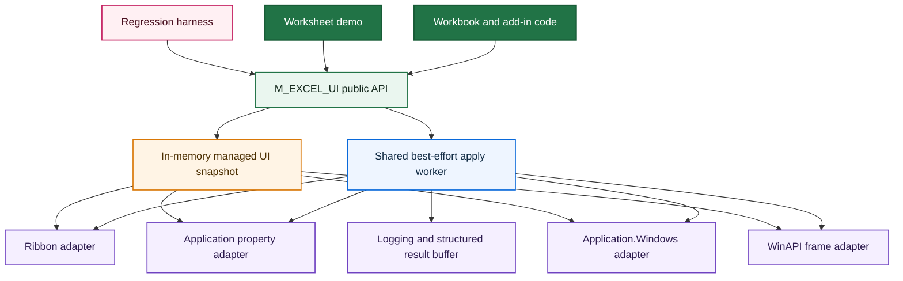
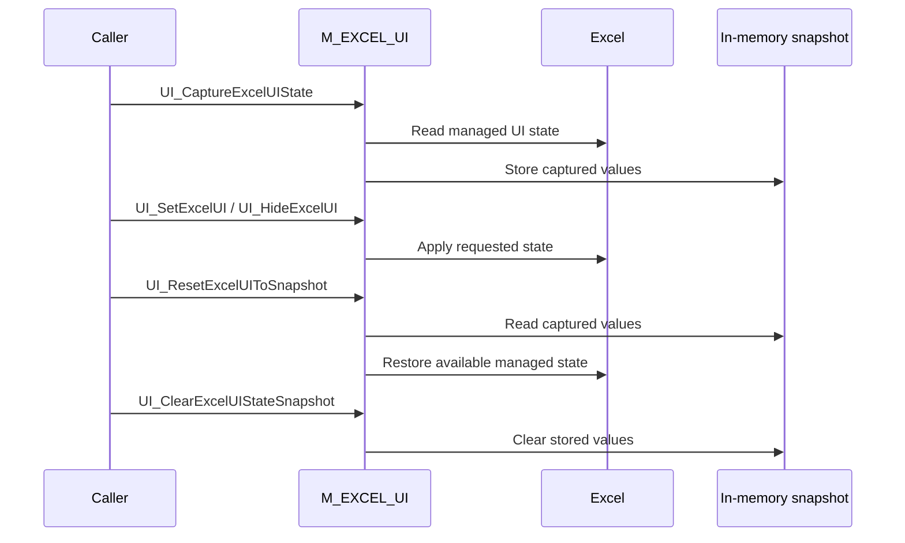

<div align="center">

# 🪟 VBA Excel UI

### A structured Windows Excel UI controller for application-style workbooks

**Tri-state visibility control · Best-effort execution · Structured diagnostics · Explicit snapshot and restore · WinAPI title-bar management · Demo and regression harness**

<br>

[](https://github.com/danielep71/VBA-EXCEL_UI)
[](#requirements)
[](#managed-ui-surface)
[](#tri-state-api)
[](#status)

<br>

[](https://github.com/danielep71/VBA-EXCEL_UI/releases)
[](LICENSE)
[](https://github.com/danielep71/VBA-EXCEL_UI/stargazers)
[](https://github.com/danielep71/VBA-EXCEL_UI/network/members)
[](https://github.com/danielep71/VBA-EXCEL_UI/issues)
[](https://github.com/danielep71/VBA-EXCEL_UI/commits/main)

<br>

**No installer · No COM add-in · No third-party DLL · No non-standard VBA reference**

[Quick start](#quick-start)
&nbsp;·&nbsp;
[Explore the API](#public-api)
&nbsp;·&nbsp;
[Review the architecture](#architecture)
&nbsp;·&nbsp;
[Open the demo workbook](demo/EXCEL_UI_DEMO.xlsm)
&nbsp;·&nbsp;
[Run the regression harness](test/M_EXCEL_UI_REGRESSION_TESTS.bas)
&nbsp;·&nbsp;
[Report a bug](https://github.com/danielep71/VBA-EXCEL_UI/issues/new?template=bug_report.md)
&nbsp;·&nbsp;
[Request a feature](https://github.com/danielep71/VBA-EXCEL_UI/issues/new?template=feature_request.md)
&nbsp;·&nbsp;
[Contributing](CONTRIBUTING.md)
&nbsp;·&nbsp;
[Security](SECURITY.md)
&nbsp;·&nbsp;
[View the Wiki](https://github.com/danielep71/VBA-EXCEL_UI/wiki)

</div>

---

<p align="center">
  
</p>

---

> [!IMPORTANT]
> **This repository is a reusable Excel UI control layer, not a collection of workbook-specific visibility toggles.**
>
> It centralizes object-model properties, Ribbon commands, WinAPI frame handling, validation, best-effort execution, diagnostics, snapshot state, restoration logic, demo behavior, and regression testing behind one documented VBA API.

## ✨ What this project is

**VBA Excel UI** is a focused VBA component for controlling the visible Excel shell on Windows.

It provides one reusable interface for:

- showing, hiding, or leaving unchanged individual Excel UI elements;
- applying application-level settings consistently;
- applying window-level settings across the current Excel instance;
- controlling the Excel main-window title bar through bitness-safe WinAPI declarations;
- capturing and restoring a managed UI baseline;
- obtaining structured failure information when callers need diagnostics as data;
- demonstrating the API through a worksheet-based interface;
- validating behavior through a repeatable regression harness.

The project is designed for:

- 🧭 guided workbook workflows;
- 🖥️ application-style Excel solutions;
- 🎤 presentations and executive demonstrations;
- 🧾 controlled data-entry environments;
- 🧪 UI regression and integration testing;
- ⚙️ reusable runtime frameworks that need a dedicated interface-management layer.

> **Positioning**
>
> A production-oriented Windows Excel UI controller for VBA projects that need explicit behavior, centralized ownership, visible contracts, and recoverable interface workflows. It is intentionally narrower than a general Excel application framework and can be used independently or as one component of a broader runtime architecture.

---

## 🌟 Why this repository is different

| Capability | Direct property toggles | Typical workbook helper | This project |
|---|:---:|:---:|:---:|
| One centralized UI-control surface | — | Sometimes | ✅ |
| Explicit show / hide / leave-unchanged semantics | — | Rarely | ✅ |
| Application-level and window-level handling | Caller-managed | Varies | ✅ |
| WinAPI title-bar control | — | Rarely | ✅ |
| 32-bit and 64-bit Office declarations | Caller-managed | Varies | ✅ |
| Best-effort continuation after one element fails | — | Rarely | ✅ |
| Structured failure count and failure list | — | Rarely | ✅ |
| Skip-if-already-correct behavior | — | Rarely | ✅ |
| ScreenUpdating preservation | Caller-managed | Varies | ✅ |
| Explicit snapshot / restore lifecycle | — | Sometimes | ✅ |
| Worksheet-based demonstration | — | Sometimes | ✅ |
| Dedicated regression harness | — | Rarely | ✅ |
| No installer or third-party runtime | ✅ | Usually | ✅ |

The purpose is not to hide the Excel object model. It is to give UI manipulation a **consistent contract, one owner, predictable diagnostics, and reusable tests**.

---

## 🧭 At a glance

<table>
<tr>
<td width="33%" valign="top">

### 🎛️ Tri-state control

Each managed element can be explicitly shown, hidden, or left unchanged. Omitted arguments do not accidentally imply hidden state.

</td>
<td width="33%" valign="top">

### 🧩 Unified surface

Ribbon, application properties, workbook-window properties, and the main window frame are controlled through one public API.

</td>
<td width="33%" valign="top">

### 🛡️ Fail-soft execution

One failed UI operation does not prevent later requested elements from being attempted.

</td>
</tr>
<tr>
<td width="33%" valign="top">

### 📋 Structured diagnostics

Callers can request a Boolean result, failure count, and ordered failure list instead of relying only on the Immediate Window.

</td>
<td width="33%" valign="top">

### 📸 Explicit state lifecycle

Capture the managed UI baseline, apply a constrained shell, and restore the captured state later.

</td>
<td width="33%" valign="top">

### 🧪 Verifiable behavior

A demo workbook and regression module exercise selective control, wrappers, diagnostics, snapshots, ScreenUpdating, and title-bar round-trips.

</td>
</tr>
</table>

---

<a id="managed-ui-surface"></a>

## 🎚️ Managed UI surface

| UI element | Scope | Mechanism | Public control |
|---|---|---|---|
| Ribbon | Excel application | `Application.ExecuteExcel4Macro` with best-effort state reads | Show / Hide / Leave unchanged |
| Status Bar | Excel application | `Application.DisplayStatusBar` | Show / Hide / Leave unchanged |
| Scroll Bars | Excel application | `Application.DisplayScrollBars` | Show / Hide / Leave unchanged |
| Formula Bar | Excel application | `Application.DisplayFormulaBar` | Show / Hide / Leave unchanged |
| Headings | Every open Excel window | `Window.DisplayHeadings` | Show / Hide / Leave unchanged |
| Workbook Tabs | Every open Excel window | `Window.DisplayWorkbookTabs` | Show / Hide / Leave unchanged |
| Gridlines | Every open Excel window | `Window.DisplayGridlines` | Show / Hide / Leave unchanged |
| Title Bar | Excel main window | WinAPI style update on `Application.Hwnd` | Show / Hide / Leave unchanged |

> [!NOTE]
> Application-level changes affect the current Excel instance. Window-level requests are applied to every window in `Application.Windows`, not only to the active workbook.

---

<a id="quick-start"></a>

# ⚡ Quick start

## 1. Import the core module

Import:

```text
src/M_EXCEL_UI.bas
```

Then choose:

```text
VBA Editor → Debug → Compile VBAProject
```

The module is intended to be imported into the workbook, add-in, or VBA project that will use it.

## 2. Apply selective UI control

```vb
UI_SetExcelUI _
    Ribbon:=UI_Hide, _
    StatusBar:=UI_Show, _
    ScrollBars:=UI_Hide, _
    FormulaBar:=UI_LeaveUnchanged, _
    Headings:=UI_Hide, _
    WorkbookTabs:=UI_Hide, _
    Gridlines:=UI_Hide, _
    TitleBar:=UI_Hide
```

Only the explicitly requested elements are changed.

## 3. Request structured diagnostics

```vb
Dim OK As Boolean
Dim FailureCount As Long
Dim FailureList As Variant
Dim i As Long

OK = UI_SetExcelUI_WithResult( _
        Ribbon:=UI_Hide, _
        StatusBar:=UI_Show, _
        ScrollBars:=UI_Hide, _
        FormulaBar:=UI_LeaveUnchanged, _
        Headings:=UI_Hide, _
        WorkbookTabs:=UI_Hide, _
        Gridlines:=UI_Hide, _
        TitleBar:=UI_Hide, _
        FailureCount:=FailureCount, _
        FailureList:=FailureList)

If Not OK Then
    For i = 1 To FailureCount
        Debug.Print FailureList(i)
    Next i
End If
```

## 4. Hide or show the complete managed shell

```vb
UI_HideExcelUI
```

```vb
UI_ShowExcelUI
```

`UI_ShowExcelUI` means **show all managed UI elements**. It does not mean restore a previously captured custom state.

## 5. Capture and restore a managed baseline

```vb
UI_CaptureExcelUIState

UI_HideExcelUI

UI_ResetExcelUIToSnapshot
```

When the captured state is no longer needed:

```vb
UI_ClearExcelUIStateSnapshot
```

---

<a id="public-api"></a>

# 🧩 Public API

## Public enum

```vb
Public Enum UIVisibility
    UI_LeaveUnchanged = -1
    UI_Hide = 0
    UI_Show = 1
End Enum
```

## API reference

| Member | Type | Purpose | Diagnostic behavior |
|---|---|---|---|
| `UIVisibility` | Public enum | Defines show, hide, and leave-unchanged states | Not applicable |
| `UI_SetExcelUI` | Public `Sub` | Applies selective managed UI state | Logs failures to the Immediate Window |
| `UI_SetExcelUI_WithResult` | Public `Function` | Applies selective UI state and returns structured diagnostics | Returns success flag, `FailureCount`, and optional `FailureList` |
| `UI_HideExcelUI` | Public `Sub` | Hides all managed UI elements | Fail-soft; logs failures |
| `UI_ShowExcelUI` | Public `Sub` | Shows all managed UI elements | Fail-soft; logs failures |
| `UI_CaptureExcelUIState` | Public `Sub` | Captures the current managed UI baseline | Best-effort; logs failures |
| `UI_ResetExcelUIToSnapshot` | Public `Sub` | Restores the most recently captured managed baseline | Best-effort; logs failures |
| `UI_HasExcelUIStateSnapshot` | Public `Function` | Reports whether an explicit snapshot exists | Returns `Boolean` |
| `UI_ClearExcelUIStateSnapshot` | Public `Sub` | Discards the explicit snapshot | No return value |

### Choosing the appropriate entry point

Use `UI_SetExcelUI` when:

- the operation is simple;
- best-effort behavior is acceptable;
- Immediate Window diagnostics are sufficient;
- the caller does not need to inspect failures programmatically.

Use `UI_SetExcelUI_WithResult` when:

- initialization or orchestration must confirm success;
- automated tests need deterministic failure information;
- a higher-level workflow must display or persist diagnostics;
- production code must distinguish complete success from partial application.

For production initialization, validation, orchestration, and test code, prefer the structured-result path.

---

<a id="tri-state-api"></a>

## 🎛️ Tri-state API

Boolean optional arguments are ambiguous in VBA because an omitted Boolean naturally defaults to `False`.

This project instead uses:

```text
UI_Show
UI_Hide
UI_LeaveUnchanged
```

That distinction is important:

| Requested value | Meaning |
|---|---|
| `UI_Show` | Make the element visible |
| `UI_Hide` | Make the element hidden |
| `UI_LeaveUnchanged` | Do not read or write the element unless required internally |
| Argument omitted | Equivalent to `UI_LeaveUnchanged` |

Invalid numeric enum values can still reach VBA enum-typed parameters at runtime. The shared worker therefore validates every requested `UIVisibility` value before converting it to a Boolean target.

---

<a id="architecture"></a>

# 🏗️ Architecture



## Public façade

The documented `UI_...` members form the reusable project-facing surface.

## Shared apply worker

Both selective entry points delegate to one internal worker so that:

- validation remains consistent;
- operation ordering remains stable;
- best-effort semantics do not drift;
- logging and structured-result paths share the same implementation.

## Environment adapters

Internal helpers isolate:

- Ribbon reads and writes;
- generic Boolean property reads and writes;
- WinAPI window-style reads and writes;
- non-client frame refresh;
- quiet-update entry and exit;
- diagnostic formatting and accumulation.

## Explicit snapshot state

The managed snapshot stores:

- application-level visibility values;
- Ribbon state when it can be read;
- per-window Headings, Workbook Tabs, and Gridlines values;
- title-bar state when it can be read;
- metadata required by the restore path.

---

## 📸 Snapshot lifecycle



### Snapshot lifetime

The explicit snapshot is stored in module-level memory.

It remains available only while the VBA project remains loaded and has not been reset. It is lost when, for example:

- Excel is closed;
- the workbook or add-in containing the module is unloaded;
- the VBA project is reset;
- code editing resets project state;
- an unhandled failure causes the VBA project to reset.

Snapshot restoration is therefore not durable recovery across Excel sessions.

> [!CAUTION]
> The current implementation captures per-window state by the ordering of `Application.Windows` and restores the common indexed range. If windows are opened, closed, replaced, or reordered between capture and restore, the operation is best effort and may not reproduce the original per-window mapping exactly.

---

## 🛡️ Execution and error policy

The module deliberately uses **best-effort processing**.

If one requested element fails:

1. the failure is recorded or logged;
2. later requested UI elements are still attempted;
3. quiet-update state is closed safely where possible;
4. the public fire-and-forget procedures do not raise the failure back to the caller.

### Fire-and-forget path

`UI_SetExcelUI` and the convenience wrappers:

- do not raise ordinary element-level failures;
- write diagnostics to the Immediate Window;
- are appropriate when a caller accepts best-effort completion.

### Structured-result path

`UI_SetExcelUI_WithResult` returns:

| Output | Meaning |
|---|---|
| `True` | No failure was recorded |
| `False` | One or more failures were recorded |
| `FailureCount` | Number of recorded failures |
| `FailureList` | Optional 1-based string array of ordered failure messages |

Failure-list entries use the form:

```text
Stage | Detail
```

### No-op suppression

Before writing a property, Ribbon state, or title-bar state, the module attempts to determine whether the requested target is already active.

Where the state can be read reliably, unnecessary writes are skipped.

### ScreenUpdating preservation

The shared apply and reset paths use a quiet-update scope:

- the existing `Application.ScreenUpdating` value is captured;
- redraw is suppressed only when required;
- the prior state is restored on normal and handled failure exits.

---

## 🪟 Title-bar control

Excel does not provide direct title-bar visibility control through the standard object model.

The project therefore updates the window style of the Excel main window represented by:

```vb
Application.Hwnd
```

The implementation includes conditional declarations for 32-bit and 64-bit Office and wraps:

- `GetWindowLong` / `GetWindowLongPtr`;
- `SetWindowLong` / `SetWindowLongPtr`;
- `SetWindowPos`;
- `GetLastError`;
- `SetLastError`.

The title-bar path:

- reads the current style;
- validates the Excel window handle;
- updates the relevant frame style;
- requests a non-client frame refresh;
- handles valid zero API returns using `GetLastError`;
- associates captured frame state with the current `Application.Hwnd`.

> [!WARNING]
> Title-bar manipulation is the most operating-system-sensitive part of the project. It is Windows-only, best effort, and may be affected by Excel version, window state, other add-ins, and Windows desktop-composition behavior.

---

## 🖼️ Interactive demo

The repository includes:

```text
demo/M_EXCEL_UI_DEMO.bas
demo/M_DEMO_BUILDER.bas
demo/EXCEL_UI_DEMO.xlsm
```

The demo can:

- build or rebuild a `DEMO_UI` worksheet;
- select managed UI elements through check boxes;
- show or hide only the selected elements;
- synchronize check boxes from the current UI state;
- apply Kiosk, Analyst, and Minimal presets;
- capture the current managed UI baseline;
- reset to the captured baseline;
- demonstrate recovery and state-management behavior.

<p align="center">
  
</p>

### Demo quick start

1. Import `src/M_EXCEL_UI.bas`.
2. Import `demo/M_EXCEL_UI_DEMO.bas`.
3. Import `demo/M_DEMO_BUILDER.bas` if the builder is maintained separately in your workbook.
4. Compile the VBA project.
5. Run:

```vb
Demo_CreateDemoSheet
```

6. Use the generated worksheet controls.

> [!CAUTION]
> The demo-sheet builder performs a destructive rebuild of the `DEMO_UI` worksheet. Do not store unrelated user data on that sheet.

---

<a id="testing"></a>

# ✅ Regression testing

The regression module is:

```text
test/M_EXCEL_UI_REGRESSION_TESTS.bas
```

## Public runners

```vb
Test_EXCEL_UI_RunCore
```

```vb
Test_EXCEL_UI_RunTitleBarOnly
```

```vb
Test_EXCEL_UI_RunAll
```

## Coverage

The harness validates:

- show-all baseline behavior;
- selective hide;
- selective show;
- leave-unchanged and no-op semantics;
- hide-all and show-all wrappers;
- structured-result clean success;
- structured-result no-op success;
- structured-result operation without failure-list capture;
- invalid `UIVisibility` handling;
- explicit snapshot lifecycle;
- reset without a snapshot;
- `Application.ScreenUpdating` preservation;
- title-bar hide/show round-trip.

The harness snapshots the current managed UI state before running and attempts to restore it afterward.

### Recommended manual sequence

1. Run `Test_EXCEL_UI_RunCore`.
2. Run `Test_EXCEL_UI_RunTitleBarOnly`.
3. Run `Test_EXCEL_UI_RunAll`.
4. Perform a manual `UI_HideExcelUI` / `UI_ShowExcelUI` recovery check.
5. Perform a manual capture / hide / reset check.

> [!IMPORTANT]
> These tests manipulate the real Excel UI of the current process. Run them in a controlled Excel instance and verify the interface after completion.

---

## 🆘 Emergency UI recovery

If a workflow is interrupted while managed Excel UI elements are hidden, run:

```vb
UI_ShowExcelUI
```

This requests visible state for every element managed by the module.

`UI_ShowExcelUI` does not require an explicit snapshot and is therefore the preferred emergency recovery command when:

- no snapshot was captured;
- the snapshot has been cleared;
- VBA project state was reset;
- the prior custom baseline is no longer available.

For development work, keep a simple recovery macro accessible from the VBA editor or Quick Access Toolbar.

---

<a id="integration-model"></a>

## 🔌 Integration model

`M_EXCEL_UI.bas` uses:

```vb
Option Explicit
Option Private Module
```

Its `Public` procedures and enum members are available throughout the VBA project that contains the module, but the module is not exposed as a conventional public automation interface to unrelated VBA projects.

This design is intentional:

- importing the module gives the consuming project one reusable UI API;
- workbook code, demo modules, and regression tests in the same project can call the documented public surface;
- implementation details remain project-scoped;
- the module does not pollute the public cross-project automation namespace.

The expected deployment model is:

```text
Import M_EXCEL_UI.bas into the consuming VBA project
                 ↓
Compile the project
                 ↓
Call the documented UI_... members from that project
```

---

## 📦 Repository structure

```text
VBA-EXCEL_UI/
├─ .gitattributes
├─ .github/
│  ├─ ISSUE_TEMPLATE/
│  │  ├─ bug_report.md
│  │  ├─ config.yml
│  │  └─ feature_request.md
│  └─ PULL_REQUEST_TEMPLATE.md
├─ .gitignore
├─ demo/
│  ├─ EXCEL_UI_DEMO.xlsm
│  ├─ M_DEMO_BUILDER.bas
│  └─ M_EXCEL_UI_DEMO.bas
├─ images/
├─ src/
│  └─ M_EXCEL_UI.bas
├─ test/
│  └─ M_EXCEL_UI_REGRESSION_TESTS.bas
├─ CODE_OF_CONDUCT.md
├─ CONTRIBUTING.md
├─ LICENSE
├─ README.md
└─ SECURITY.md
```

| Path | Purpose |
|---|---|
| `.gitignore` | Excludes Office lock files, editor state, logs, generated output, caches, and local secrets |
| `.gitattributes` | Enforces CRLF for exported VBA source and binary handling for Excel and image artifacts |
| `.github/ISSUE_TEMPLATE/bug_report.md` | Standardized compatibility, UI-state, diagnostic, and recovery bug reports |
| `.github/ISSUE_TEMPLATE/feature_request.md` | Structured enhancement requests with scope and Semantic Versioning analysis |
| `.github/ISSUE_TEMPLATE/config.yml` | Issue chooser configuration and private security-reporting link |
| `.github/PULL_REQUEST_TEMPLATE.md` | Standardized API, WinAPI, snapshot, test, recovery, and release review checklist |
| `src/M_EXCEL_UI.bas` | Production UI controller |
| `demo/M_EXCEL_UI_DEMO.bas` | Demo actions and worksheet integration |
| `demo/M_DEMO_BUILDER.bas` | Demo worksheet construction |
| `demo/EXCEL_UI_DEMO.xlsm` | Ready-to-open demonstration workbook |
| `test/M_EXCEL_UI_REGRESSION_TESTS.bas` | Regression harness |
| `images/` | Repository visual assets |
| `README.md` | Main technical and usage guide |
| `CONTRIBUTING.md` | Contribution workflow, code standards, tests, and PR expectations |
| `CODE_OF_CONDUCT.md` | Standards for respectful and constructive project interaction |
| `SECURITY.md` | Supported versions, private reporting, scope, and safe-use guidance |
| `LICENSE` | MIT license |

> [!NOTE]
> `.gitattributes` deliberately enforces CRLF for exported `.bas`, `.cls`, and
> `.frm` files. Excel workbooks, images, archives, and `.frx` form companions are
> marked binary. `.gitignore` does **not** exclude exported VBA source or the
> official `demo/EXCEL_UI_DEMO.xlsm` artifact.

---

## 📚 Documentation map

| Documentation | Purpose |
|---|---|
| [README](README.md) | Project overview, API, architecture, installation, tests, and limitations |
| [Wiki Home](https://github.com/danielep71/VBA-EXCEL_UI/wiki) | Additional repository guidance |
| [Core module](src/M_EXCEL_UI.bas) | Authoritative implementation and detailed procedure contracts |
| [Demo module](demo/M_EXCEL_UI_DEMO.bas) | Interactive usage patterns |
| [Demo builder](demo/M_DEMO_BUILDER.bas) | Reproducible demo-sheet construction |
| [Regression tests](test/M_EXCEL_UI_REGRESSION_TESTS.bas) | Behavioral verification and release validation |
| [Demo workbook](demo/EXCEL_UI_DEMO.xlsm) | Ready-to-run interactive example |
| [Contributing Guidelines](CONTRIBUTING.md) | Branching, coding standards, testing, binary-workbook review, and PR checklist |
| [Code of Conduct](CODE_OF_CONDUCT.md) | Respectful, evidence-led project interaction and reporting |
| [Security Policy](SECURITY.md) | Private vulnerability reporting, supported versions, scope, and safe use |
| [Bug Report Template](.github/ISSUE_TEMPLATE/bug_report.md) | Required environment, UI-state, reproduction, regression, and recovery evidence |
| [Feature Request Template](.github/ISSUE_TEMPLATE/feature_request.md) | Proposed behavior, targeting, diagnostics, compatibility, and validation |
| [Pull Request Template](.github/PULL_REQUEST_TEMPLATE.md) | Standard review contract for API, state ownership, WinAPI, tests, and documentation |
| [Excel VBA Runtime Framework](https://github.com/danielep71/excel-vba-runtime-framework) | Parent framework and related runtime components |

---

## 🔧 Source-code style

The source follows a deliberately structured VBA house style:

- `Option Explicit`;
- `Option Private Module`;
- explicit public and private surface documentation;
- section banners;
- structured procedure headers;
- comments above related executable statements;
- inline comments primarily for declarations;
- explicit initialization, validation, apply, safe-exit, and failure sections;
- centralized error and diagnostic helpers;
- explicit 32-bit and 64-bit conditional compilation;
- permanent regression cases for corrected defects.

Procedure headers use relevant fields such as:

```text
PURPOSE
WHY THIS EXISTS
INPUTS
RETURNS
BEHAVIOR
ERROR POLICY
DEPENDENCIES
NOTES
UPDATED
```

The emphasis is on inspectability, predictable behavior, and maintainability inside the limitations of the VBA editor.

---

## 🎓 Example applications

<details>
<summary><strong>🖥️ Application-style workbooks</strong></summary>

- reduce visible spreadsheet chrome;
- expose only the interface required by the workflow;
- apply a repeatable shell when the workbook opens;
- restore the visible Excel interface when the workflow closes.

</details>

<details>
<summary><strong>🧾 Controlled data-entry solutions</strong></summary>

- hide implementation-oriented UI elements;
- reduce accidental navigation away from intended inputs;
- standardize the interface across users;
- combine UI state with workbook validation and event-driven controls.

</details>

<details>
<summary><strong>🎤 Demonstrations and executive walkthroughs</strong></summary>

- suppress distracting workbook controls;
- present Excel as a focused application surface;
- apply and restore presentation profiles consistently;
- retain an emergency show-all recovery path.

</details>

<details>
<summary><strong>⚙️ Runtime frameworks</strong></summary>

- delegate UI management to one dedicated component;
- keep execution control, event orchestration, and interface control separate;
- use structured diagnostics in higher-level startup and shutdown flows;
- combine with navigation, logging, and workbook lifecycle components.

</details>

<details>
<summary><strong>🧪 Testing and integration</strong></summary>

- establish a known UI baseline before automation;
- verify selective state changes;
- test recovery after constrained-shell operation;
- detect regressions in title-bar or Ribbon handling.

</details>

---

---

## 🔒 Security and safe use

This project contains executable VBA and a macro-enabled demonstration workbook.

- Obtain source and artifacts only from the official repository or a tagged release.
- Review `.bas` modules before importing them.
- Treat `.xlsm` files as executable content.
- Keep organizational macro-security controls enabled.
- Do not treat hidden Excel UI as an access-control or security boundary.
- Maintain an accessible `UI_ShowExcelUI` recovery path in constrained-shell solutions.
- Report suspected vulnerabilities privately under [SECURITY.md](SECURITY.md).

The project does not require a third-party DLL, installer, background service, or
automatic update mechanism.


<a id="requirements"></a>

# 💻 Requirements

- Microsoft Excel desktop for Windows;
- a macro-enabled workbook or add-in host;
- VBA project access for importing `.bas` modules;
- WinAPI access available in the host environment;
- 32-bit or 64-bit Office supported through conditional compilation.

## Unsupported platforms

- Excel for macOS;
- Excel for the web;
- environments that block the required WinAPI calls;
- non-Excel VBA hosts.

No third-party DLL, COM component, package manager, or non-standard VBA reference is required.

---

<a id="limitations"></a>

# 🔍 Scope and limitations

The project makes UI behavior centralized and testable, but it does not eliminate the environmental characteristics of Excel and Windows.

## Current boundaries

- **Windows only.** Title-bar control depends on WinAPI.
- **Current Excel instance.** Application-level settings affect the running Excel process.
- **All open windows.** Headings, Workbook Tabs, and Gridlines requests apply across `Application.Windows`.
- **Best-effort Ribbon control.** Ribbon reads and writes depend on Excel host behavior and legacy macro support.
- **Best-effort title-bar control.** Frame behavior can vary with Excel version, window mode, Windows composition, and other add-ins.
- **In-memory snapshots.** Captured state does not survive a VBA reset or Excel restart.
- **Index-based per-window restoration.** Changes to the number or order of windows between capture and reset can affect exact restoration.
- **No durable transaction.** The module cannot guarantee atomic rollback if the host process terminates.
- **Visible refresh may occur.** ScreenUpdating suppression cannot fully eliminate Ribbon or non-client frame repaint.
- **Not a security boundary.** Hiding Excel UI does not prevent a knowledgeable user or other code from changing workbook or application state.

## Appropriate use cases

The project is particularly suited to:

- controlled internal workbooks;
- reusable application-style Excel solutions;
- demo and presentation environments;
- guided workflows;
- UI orchestration inside broader VBA frameworks;
- environments where transparent source code is preferred.

## It is not intended to replace

- a full Windows desktop application framework;
- Excel security, workbook protection, or access control;
- an enterprise policy-enforcement agent;
- a cross-platform Excel UI abstraction;
- a persistent workspace manager;
- a certified recovery or safety-critical control system.

The exact release tag or commit SHA should be recorded when reproducibility matters.

---

## 🧭 Design principles

1. **Explicit caller intent**  
   Use tri-state values rather than ambiguous optional Booleans.

2. **One owner for UI state changes**  
   Avoid scattering raw toggles throughout workbook code.

3. **Continue where safe**  
   One failed element should not prevent unrelated requested changes.

4. **Expose diagnostics when required**  
   Simple callers may log; orchestration code can request structured results.

5. **Separate show-all from restore**  
   A deterministic visible shell and a captured custom baseline are different operations.

6. **Preserve host state where possible**  
   Avoid unnecessary writes and restore `ScreenUpdating`.

7. **Document platform-sensitive behavior**  
   Ribbon and title-bar paths remain explicitly best effort.

8. **Keep the component independently deployable**  
   The module can be used without the wider runtime framework.

---

## 🧭 Roadmap

The roadmap is directional rather than contractual.

### Maintenance and assurance

- strengthen supported-environment documentation;
- expand failure-path regression coverage;
- improve automated release validation;
- add API/documentation consistency checks;
- preserve backward compatibility of the existing `UI_...` surface.

### Candidate v1.1.x improvements

- identity-safe per-window snapshot restoration;
- structured-result capture and reset functions;
- explicit complete / partial snapshot status;
- safer ownership of title-bar style bits;
- optional active-window or workbook targeting;
- clearer machine-readable failure categories;
- internal decomposition of the core module without changing the public API.

### Potential future major-version work

- typed state and result objects;
- a formal workbook/window scope model;
- stricter error-propagation options;
- an add-in-oriented public automation layer;
- transactional state application where the Excel host permits it.

Correctness, recovery behavior, compatibility, and regression coverage take priority over headline feature count.

---

## 🤝 Contributing

Read [CONTRIBUTING.md](CONTRIBUTING.md) before starting non-trivial work.
All participation is governed by [CODE_OF_CONDUCT.md](CODE_OF_CONDUCT.md).
Suspected vulnerabilities must follow [SECURITY.md](SECURITY.md).

Use the repository templates:

- [Bug report](.github/ISSUE_TEMPLATE/bug_report.md)
- [Feature request](.github/ISSUE_TEMPLATE/feature_request.md)
- [Pull request](.github/PULL_REQUEST_TEMPLATE.md)

Contributions are welcome, particularly:

- reproducible Excel-version or Windows-version defects;
- Ribbon and title-bar compatibility findings;
- recovery improvements;
- structured-diagnostic enhancements;
- additional regression cases;
- documentation corrections;
- demo improvements;
- performance improvements that preserve behavior.

Before opening a non-trivial pull request:

1. open an issue to discuss scope;
2. preserve existing public procedure signatures unless a breaking release is intended;
3. document the affected UI scope and host assumptions;
4. add or update regression cases;
5. compile the VBA project;
6. run the complete regression harness;
7. perform a manual recovery check;
8. re-export edited `.bas` modules from the VBE;
9. review the text diff;
10. update the README and Wiki where applicable.

---

## ✅ Release checklist

A release candidate should satisfy all applicable items:

```text
[ ] Confirm the intended release branch
[ ] Import the current production module
[ ] Import the current regression module
[ ] Debug → Compile VBAProject
[ ] Run Test_EXCEL_UI_RunCore
[ ] Run Test_EXCEL_UI_RunTitleBarOnly
[ ] Run Test_EXCEL_UI_RunAll
[ ] Confirm ScreenUpdating is restored
[ ] Perform UI_HideExcelUI / UI_ShowExcelUI recovery
[ ] Perform capture / hide / reset validation
[ ] Verify 32-bit and 64-bit declarations where environments are available
[ ] Re-export changed .bas modules
[ ] Confirm .gitattributes preserved CRLF for exported VBA source
[ ] Confirm Office, image, form-binary, and workbook artifacts remain binary
[ ] Review the text diff
[ ] Update module version metadata
[ ] Update README and Wiki documentation
[ ] Review issue and pull-request templates when API, diagnostics, recovery, or required evidence changes
[ ] Review CONTRIBUTING.md, CODE_OF_CONDUCT.md, and SECURITY.md when governance or scope changes
[ ] Confirm no unintended binary workbook change
[ ] Merge the release pull request
[ ] Tag the merged commit
[ ] Publish the GitHub release
```

<a id="status"></a>

## 📌 Status

The project is stable and intended as a reusable VBA component for Excel-based solutions on Windows.

The public API is deliberately compact. Future backward-compatible releases may improve recovery, diagnostics, targeting, tests, and internal architecture without changing the established `UI_...` calling surface.

---

## 👤 Author

**Daniele Penza**

---

## 📄 License

This project is licensed under the terms of the [MIT License](LICENSE).

---

<div align="center">

### Build Excel interfaces with explicit state, centralized control, and a reliable recovery path.

[Back to top](#-vba-excel-ui)

</div>
