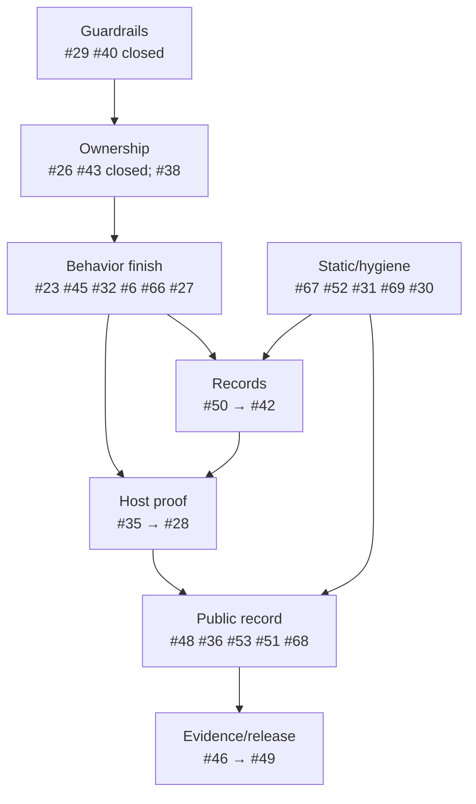

# VBA-EXCEL_UI v1.1.3 — Implementation Sequence and Release Gates

**Repository:** `danielep71/VBA-EXCEL_UI`
**Released baseline:** `v1.1.2`
**Baseline commit:** `bdfdde4de9ed9607589aa30df3c9440eb9725de2`
**Target milestone:** `v1.1.3 — correctness & hardening`
**Planning basis:** `3d8fcdcf38ee9c4166ec10bf63f23a106b033bac`
**Status date:** 2026-09-03

This is the authoritative execution sequence for v1.1.3. GitHub issue bodies
remain the acceptance-contract authority. This document records ordering,
dependencies, closure discipline, and a point-in-time copy of every open issue
body without relying on predicted issue numbers or withdrawn review archives.

## 1. Release boundary and live state

v1.1.3 is a corrective release. It may change internal production, test,
documentation and release-engineering behavior, but it must not change the
12-member supported caller-facing facade. #44 (opt-in Ribbon activation) and
#22 (rebuilt demo behavior) remain in v1.2.0.

At this planning basis:

- `release/v1.1.3` points to PR #63 merge `3d8fcdcf38ee9c4166ec10bf63f23a106b033bac`.
- Static checks #113 passed 24/24 on that exact merge head.
- The API manifest has 42 live declarations: 12 `[supported]` and 30
  `[project-public]`, plus the frozen 12-entry v1.1.2 facade baseline.
- The milestone contains **25 open and 4 closed issues**.
- Root `VERSION` remains `1.1.2`.
- Governed Wiki revision `f65531a40134d81b0156dbb522a78917ed39da21`
  still tracks v1.1.2.
- The independent-review archives remain withdrawn. #48 owns their mandatory
  public replacement crosswalk.

## 2. Completed work and closure audit

| Issue | Checklist | Audit result | Comment disposition |
|---|---:|---|---|
| #26 | 13/13 | Correctly closed; quiet ownership requires successful read/write/readback. | Premature closure was superseded; final closure at `02de0ab` is coherent. #35 owns final residue detection. |
| #29 | 12/12 | Correctly closed; Markdown escape/hygiene gate landed. | Closure comment binds the Wave 1 evidence. |
| #40 | 11/11 | Correctly closed; archives were repaired and then prospectively withdrawn. | Comments preserve both phases and hand the public crosswalk to #48. |
| #43 | 21/21 | Correctly closed; caller snapshots survive destructive-runner refusal. | Historical premature closure comments are superseded; final closure at `32baef3` is supported. |

No closed issue was reopened.

## 3. PR #63 disposition: merged is not closed

PR #63 merged core work for #45, #32 and #6, but none is closure-complete:

- **#45:** object/native pairing and mismatch refusal are implemented. Public
  no-write evidence and module/Wiki wording remain.
- **#32:** slots retain an Excel `Window`, but the seam changes numeric hWnd;
  it does not prove reuse of the same hWnd by a different owner generation.
- **#6:** `HasBaseline`, fallback and readback exist, but `WS_CAPTION` is
  composite and merged code still uses any-bit tests. The rule must be
  `(style And WS_CAPTION) = WS_CAPTION`. Its control hangs under #66.

The PR review record now matches this: active-handle mismatch is resolved with
evidence; composite-mask and true same-hWnd findings remain open.

## 4. Revised dependency map and waves



| Wave | Status | Issues | Exit condition |
|---|---|---|---|
| 1 | Foundation complete | #47, #37, #40 + #29, #53 foundation | API baseline, pins/tag trigger, archive boundary, Markdown and Wiki gates implemented; release evidence remains. |
| 2 | Core complete; #38 remains | #43 ✓, #26 ✓, #38 | Finish diagnostic-allocation degradation. |
| 3A | Merged, not closed | #45, #32, #6 | PR #63 core exists; remaining proof defects stay open. |
| 3B | Next behavior | #23, #45, #32, #6, #66, #27, #67 | Lead with P1 Ribbon refusal; fix caption mask, true same-hWnd proof and bounded restoration; finish #45/#27. |
| 4 | Static/audit/hygiene | #52 → #31, #69, #30 | Stabilize analysis and line endings, then audit demo modules. |
| 5 | Record integrity | #50 → #42 | Atomic records, then exact mandatory inventory; PR #63 cases enter only after #66. |
| 6 | Host proof | #35 → #28 | Detect #26 residue and all final mismatches, then achieved-state verification. |
| 7 | Public traceability/version | #48, #36, #53, #51, #68 | Crosswalk, host decision, README hierarchy, Wiki-first version transition, green gate before freeze. |
| 8 | Exact-source certification | #46 and final host matrix | Freeze one source head and bind every result to exact identities/hashes. |
| 9 | Readiness/tag proof | #49, then release-deferred closures | Merge with tree equality, tag verified merge, require tag CI, then close. |

The earlier plan assumed `#45 → #32 → #6` would all land later. PR #63 merged
their core code but left exact proof work. Waves 4–9 therefore depend on issue
closure conditions, not mere merge status: #42 waits for #66, #35/#28 observe
the final behavior, #48 distinguishes merged from closed, Wave 7 finishes Wiki
claims, and certification starts only after source/test changes stop.

## 5. Issue-number discipline

Issues and PRs share one sequence; PRs #54–#65 consumed that range.

1. Never reserve, predict or publish a placeholder issue/PR number.
2. Create the issue or PR first.
3. Record the number GitHub actually assigns.
4. Update dependencies and this plan afterward.

The current additions are actual issues #66–#69. No predicted-number placeholder
remains in milestone bodies/comments.

## 6. Critical contract clarifications

### #35 owns #26's unowned final residue

If the quiet write succeeds but verification readback fails,
`QuietModeChanged = False`; End scope does not restore, and
`ScreenUpdating` may remain `False` and unowned. #35 must fail that final
baseline mismatch before test-owned recovery.

### #48 is a hard public dependency

After #40 withdrew the archives, unversioned `ICR-UI-*` and
`ICR-UI-111-*` citations in production modules, tests and changelog resolve to
no public source. #48 must publish a unique self-contained mapping for every
unversioned, 111-series and 112-series occurrence.

### #53's two-repository transition

Root `VERSION = 1.1.3` makes the Wiki gate expect
`wiki_tracks-v1.1.3`. Wave 7 must:

1. update/review all governed Wiki badges first;
2. record that Wiki SHA;
3. commit root `VERSION`, module headers and governed repository docs at 1.1.3;
4. rerun the Wiki gate against the resulting repository head and recorded Wiki SHA;
5. require green before freeze.

No release evidence is valid during the short cross-repository gap.

## 7. Newly owned gaps

- #67 — narrowly ignored scratch location for disposable mutants/controls.
- #68 — exactly one README H1 with anchors/navigation preserved.
- #69 — restore Windows-native CRLF overrides and fixture-backed policy.

## 8. Exact-source release procedure

1. Finish Wave 3B behavior and host-safe controls.
2. Finish static/hygiene/demo audit; file findings under actual assigned numbers.
3. Complete atomic records and mandatory inventory.
4. Complete final-baseline and achieved-state certification.
5. Publish #48 crosswalk and make #51 host decision.
6. Update Wiki first, then repository version metadata; require green before freeze.
7. Freeze one head and record commit/tree identities.
8. Run static/API/formatter/Wiki gates on that head.
9. Run the supported Windows/Excel matrix and bind evidence under #46.
10. Settle human and automated review; write Validation only after source is quiet.
11. Reconfirm reviewed/certified tree equals the release-merge tree.
12. Merge, tag the verified merge, require tag-SHA CI, then close deferred issues.

## 9. Closure discipline

- Checkboxes represent verified evidence, not intent.
- “Merged” is not “closed” where docs, controls or release evidence remain.
- Do not use `Closes #...` for issues with Wiki/runtime/exact-head/tag work.
- Any `.bas` change, even a comment/header edit, invalidates source certification.
- Historical comments remain visible; stale claims are explicitly superseded.
- GitHub bodies are live authority; refresh this appendix after material changes.

## Appendix A — Live open milestone issues

Generated from GitHub after the 2026-09-03 audit. Bodies are verbatim.


### #6 — ICR-UI-112-P2-03 — Show can adopt a non-zero captionless baseline and report success

**State:** open
**Labels:** `bug`, `P2`, `titlebar`, `tests`
**Milestone:** `v1.1.3 — correctness & hardening`
**Assignee:** `danielep71`
**Checklist:** 3/12
**Issue comments reviewed:** 4

<details>
<summary>Full issue body</summary>

## Summary

Reopened after the independent review of `v1.1.2`.

The original title-bar recovery defect was corrected by replacing an **all-zero**
show baseline with `TITLEBAR_DEFAULT_STYLE_BITS`. That covers the cold-start /
post-VBA-reset case originally filed here.

`v1.1.2` still accepts a **non-zero** owned-bit baseline that does not contain
`WS_CAPTION`. A foreign component can leave sizing, system-menu, minimize or
maximize bits without the caption bit. The worker adopts that value, bypasses
the `RestoreBits = 0` fallback, reaches the no-op path and reports success even
though the title bar remains hidden according to the component's own visibility
reader.

## Failure sequence

```text
component previously hid frame
another component writes non-zero owned bits without WS_CAPTION
registry entry is invalidated and rebuilt
live captionless bits become OwnedStyleBits
RestoreBits <> 0, so default-visible fallback is skipped
show merge produces CurrentStyle unchanged
no-op branch returns True
UI_TryGetTitleBarVisibleForHwnd still returns False
```

This breaks both the emergency recovery promise and the structured-result
contract: a failed show is reported as success.

The registry state already contains a `HasBaseline` field: it is declared and
written during baseline capture, but the show path never reads it. The code
therefore conflates “no baseline was captured” with “a baseline was captured and
its owned bits were legitimately zero.” The missing discriminator does not need
to be invented; it needs to be consulted together with the caption-visibility
test.

## Required correction

A baseline is valid for a show only when capture is known and it represents a
visible title bar:

```text
HasBaseline = True
(RestoreBits And WS_CAPTION) = WS_CAPTION
```

`HasBaseline = False` requires recovery fallback. A known baseline whose owned
bits lack `WS_CAPTION` is also unusable for show, whether those bits are zero or
non-zero.

When no trustworthy visible baseline exists, `UI_ShowExcelUI` should merge the
safe full owned frame into the current style while preserving every unrelated
bit. After every show path—including the no-op path—the worker must read back the
live style and verify the complete composite mask with
`(style And WS_CAPTION) = WS_CAPTION` before returning success.

## Current implementation status — merged, not closure-complete

PR #63 merged the `HasBaseline` discriminator, fallback merge, and post-operation
readback at `3d8fcdcf38ee9c4166ec10bf63f23a106b033bac`. Final review found that the
merged checks still use an any-bit test for composite `WS_CAPTION`; that is not
equivalent to requiring the complete caption mask. The negative mutation control
also hangs instead of failing and is tracked by #66. This issue therefore remains
open until both the complete-mask correction and bounded control evidence land.

## Acceptance criteria

- [x] The show path consults `HasBaseline` and does not infer baseline existence
      from `RestoreBits <> 0`.
- [ ] The show path treats any baseline lacking `WS_CAPTION` as unavailable,
      whether it is zero or non-zero.
- [x] The recovery fallback restores a visible owned frame without changing
      unrelated style bits.
- [ ] A successful show is confirmed by a post-operation style readback with
      `(style And WS_CAPTION) = WS_CAPTION`.
- [ ] The no-op branch cannot return success solely because `NewStyle =
      CurrentStyle`; achieved visibility must also be true.
- [ ] A failed readback or missing caption returns `False` with a precise
      `TitleBar` diagnostic.
- [ ] Regression coverage includes:
      - all-zero cold-start baseline;
      - non-zero captionless baseline;
      - already-visible no-op;
      - foreign captioned frame;
      - preservation of unrelated style bits.
- [ ] The non-zero captionless regression fails against `v1.1.2` and passes only
      with the correction.
- [ ] Both fire-and-forget and `_WithResult` public paths are covered.
- [ ] The title bar is restored to its entry state on every test exit path.
- [ ] README, Wiki, changelog and procedure headers describe the broader
      visibility rule, not only the zero-baseline case.
- [x] No supported public API change.

## Historical note

The original #6 all-zero recovery scenario was fixed before `v1.1.0` and remains
covered. This issue is reopened because the later review found that the chosen
condition—`RestoreBits = 0`—was narrower than the actual visibility contract.

- #32 — frame-registry generation identity


## Codex review traceability

The live non-zero captionless false-success path was identified in [PR #41](https://github.com/danielep71/VBA-EXCEL_UI/pull/41#discussion_r3829133333). Final review of PR #63 also found that the merged implementation accepts a partial composite `WS_CAPTION` mask. Both review threads remain open until the complete-mask regression, bounded negative control under #66, and post-operation readback pass against the exact v1.1.3 source.


</details>

### #23 — ICR-UI-112-P1-01 — Ribbon snapshot restore must fail closed on the wrong active window

**State:** open
**Labels:** `bug`, `P1`, `sdi`, `snapshots`, `tests`, `ribbon`
**Milestone:** `v1.1.3 — correctness & hardening`
**Assignee:** `danielep71`
**Checklist:** 0/12
**Issue comments reviewed:** 0

<details>
<summary>Full issue body</summary>

## Summary

Ribbon visibility is per Excel workbook window under SDI. `v1.1.2` captures one
Ribbon Boolean without retaining the `Window` it came from, and restoration uses
the active-window Ribbon command. A value captured from window A can therefore
be applied to active window B while A remains unrestored, with success reported.

This is a **P1 wrong-target state application** and belongs in the corrective
`v1.1.3` patch. Automatic activation of the captured window is a separate
minor-release feature because it can fire events and visibly change focus.

## v1.1.3 scope — fail closed, do not activate

Capture the Ribbon-owning Excel `Window` alongside the Boolean. On restore:

```text
captured Window is closed or unusable   -> Ribbon failure; no write
captured Window is not ActiveWindow     -> Ribbon failure; no write
captured Window is ActiveWindow         -> apply the captured value
```

The patch must not call `Window.Activate`, change focus, or fire activation
side effects merely to complete restoration.

## Why this is the safe patch behavior

Every Ribbon mechanism available to this component acts on the active window and
accepts no target argument. When the captured target is not active, the current
implementation cannot perform the requested operation accurately. Refusing and
reporting is therefore correct; silently redirecting is not.

## Acceptance criteria

- [ ] Snapshot state retains the exact Excel `Window` from which Ribbon
      visibility was read, plus a diagnostic label.
- [ ] A Ribbon value is marked Known only when both the value and its owning
      `Window` identity were captured.
- [ ] Restore proves the retained `Window` is still usable.
- [ ] Restore compares the retained object with `Application.ActiveWindow` by
      object identity, never caption, workbook name, index or hWnd alone.
- [ ] A closed captured window returns an ordered `Ribbon | ...` failure and
      performs no Ribbon write.
- [ ] A different active window returns an ordered `Ribbon | ...` failure and
      performs no Ribbon write.
- [ ] The same-active-window capture/restore path retains its existing behavior.
- [ ] The fire-and-forget wrapper logs the refusal; the `_WithResult` path
      returns `False` with the failure in order.
- [ ] Regression cases cover capture on A / activate B / restore, a closed
      captured window, and the normal same-window path.
- [ ] The tests prove B was not changed when restoration refused.
- [ ] No public procedure, parameter, enum value or default changes.
- [ ] README, Wiki, changelog and module headers describe the fail-closed patch
      behavior precisely.

## Explicitly out of scope

- automatically activating the captured window;
- adding a public activation policy;
- suppressing or replaying `Workbook_WindowActivate` events;
- changing `UIWindowTargetScope` semantics for the Ribbon.

Those belong in #44, the v1.2.0 activation-policy issue.

- `docs/RIBBON_SDI_BEHAVIOR.md`
- #21 — SDI characterization
- #14 — the equivalent wrong-target defect previously corrected for the title bar

</details>

### #27 — ICR-UI-112-P3-05 — Capture WinAPI failure detail immediately through Err.LastDllError

**State:** open
**Labels:** `P3`, `titlebar`, `tests`
**Milestone:** `v1.1.3 — correctness & hardening`
**Assignee:** `danielep71`
**Checklist:** 0/13
**Issue comments reviewed:** 0

<details>
<summary>Full issue body</summary>

## Summary

`M_EXCEL_UI_TITLEBAR` declares and calls `GetLastError` directly while VBA already
exposes the current DLL error through `Err.LastDllError`. The direct declaration
is not inherently wrong, but two mechanisms for the same state invite drift and
make the ordering rule less obvious.

For WinAPI functions where zero can be either a valid return value or failure,
the reliable pattern is:

```text
SetLastError 0
call the WinAPI function
capture return value
capture Err.LastDllError immediately
perform no intervening call and execute no intervening On Error statement
interpret zero return + LastDllError=0 as valid zero
interpret zero return + LastDllError<>0 as failure
```

The error value must be copied before formatting, logging, another API call, or
any `On Error` statement can overwrite it.

## Scope

Standardize the title-bar module and regression helpers on one error-capture
contract. `SetLastError` may remain because it is needed to disambiguate an
ambiguous zero return; the declared `GetLastError` wrappers should normally be
removed in favor of immediate `Err.LastDllError` capture.

## Acceptance criteria

- [ ] Every ambiguous-zero WinAPI call is inventoried, including
      `GetWindowLong[Ptr]`, `SetWindowLong[Ptr]` and any harness equivalents.
- [ ] `SetLastError 0` is executed immediately before each ambiguous-zero call.
- [ ] The API return value and `Err.LastDllError` are copied to locals
      immediately after the call and before any other call, formatting helper,
      logging helper or `On Error` statement.
- [ ] A zero API return with captured DLL error zero is treated as a valid zero
      result where the Windows contract permits it.
- [ ] A zero API return with a non-zero DLL error returns `False` with the exact
      API name, operation, error number and target hWnd in the diagnostic.
- [ ] Non-zero successful returns do not carry stale DLL error state into later
      diagnostics.
- [ ] Direct `GetLastError` declarations and wrappers are removed unless one
      retained use is justified in the issue with a concrete VBA limitation.
- [ ] `SetLastError` declarations remain bitness-correct and explicitly aliased
      where project naming differs from the exported API name.
- [ ] Regression seams cover valid-zero, injected non-zero DLL error and stale
      prior error scenarios.
- [ ] Source inspection covers VBA7 x64, VBA7 x86 and legacy x86 branches.
- [ ] Procedure headers and contributor rules state the capture-immediately
      invariant.
- [ ] The static gate gains a focused check or fixture for reading
      `Err.LastDllError` after an intervening call / `On Error` in an API failure
      path.
- [ ] No supported public API change.

- Microsoft VBA `Err.LastDllError` documentation
- Microsoft `GetWindowLongPtr` / `SetWindowLongPtr` ambiguous-zero guidance


</details>

### #28 — ICR-UI-112-P3-06 — Certification must verify achieved UI state after writes

**State:** open
**Labels:** `P3`, `tests`, `release-engineering`
**Milestone:** `v1.1.3 — correctness & hardening`
**Assignee:** `danielep71`
**Checklist:** 0/15
**Issue comments reviewed:** 0

<details>
<summary>Full issue body</summary>

## Summary

Production setters intentionally remain best effort: they treat a write that
raises no runtime error as successful. Excel or Windows can nevertheless accept
a call without achieving the requested visible state.

The release path must therefore verify outcomes independently:

```text
write -> settle -> read -> compare
```

This issue concerns **operation-level achieved-state verification**. It is
separate from #35, which verifies that the complete host baseline is restored
after the suite.

## Required verification model

For each managed element and target scope, certification records one of:

```text
verified-no-op
verified-write
write-failed
readback-failed
state-mismatch
restore-failed
not-verifiable (with explicit reason)
```

A successful production return does not make the certification case pass until
readback confirms the requested state.

## Acceptance criteria

- [ ] A mandatory strict-verification unit runs under
      `Test_EXCEL_UI_RunReleaseCertification`.
- [ ] Status Bar, Scroll Bars and Formula Bar are written, settled, read back and
      compared.
- [ ] Headings, Workbook Tabs and Gridlines are verified for every supported
      `UIWindowTargetScope`, including non-target windows remaining unchanged.
- [ ] Title-bar hide and show are read back from the exact object/native frame
      identity established by #45; a successful show requires the complete composite mask
      `(style And WS_CAPTION) = WS_CAPTION`.
- [ ] Ribbon verification is performed only against the identified active
      owning window; inability to address or read it is `not-verifiable`, never
      a silent pass.
- [ ] Both changed-state and already-correct no-op paths are verified.
- [ ] A failed write, failed readback and achieved-state mismatch are distinct
      outcomes with different diagnostic text.
- [ ] A mismatch fails the mandatory unit even when the production setter
      returned `True`.
- [ ] Verification waits are bounded and centralized; tests do not hide races by
      scattering arbitrary delays.
- [ ] Every test restores its entry state and reports restoration failure.
- [ ] JSON evidence contains per-element requested, observed and outcome fields.
- [ ] The text report summarizes every mismatch and unverifiable surface.
- [ ] Fault seams demonstrate ignored/ineffective writes and readback failures
      without relying on a naturally failing host.
- [ ] Production setter behavior and public signatures remain unchanged.
- [ ] Changelog states that strict readback is a release-certification feature,
      not a new guarantee of the fire-and-forget API.

## Relationship to other issues

- #6 fixes a concrete false-success title-bar show path in production.
- This issue verifies achieved state across all managed surfaces.
- #35 verifies full cleanup against the entry baseline.
- #42 verifies the mandatory case inventory.

- `ICR-UI-112-P3-06` — stable identifier from the historical independent review. The review archive was withdrawn from the current tree under #40; this issue is self-contained.


</details>

### #30 — Complete a procedure-level defect audit of both demo source modules

**State:** open
**Labels:** `P3`, `demo`
**Milestone:** `v1.1.3 — correctness & hardening`
**Assignee:** `danielep71`
**Checklist:** 0/15
**Issue comments reviewed:** 0

<details>
<summary>Full issue body</summary>

## Summary

The v1.1.2 review assessed the demo as an adoption/integration surface and
confirmed one concrete defect in `Demo_GetRuntimeErrorText`. It did not establish
that every procedure in `demo/M_EXCEL_UI_DEMO.bas` and
`demo/M_DEMO_BUILDER.bas` received a complete line-by-line audit.

This issue closes that remaining review boundary before the broader v1.2.0 demo
redesign. It is an **audit issue**: the review itself is read-only. Any genuine
defect found must be recorded precisely and fixed in a focused commit or separate
issue; feature work and visual redesign remain out of scope.

## Audit scope

Read both modules in full and inventory:

- every procedure, caller and callee;
- public procedures used by worksheet controls / `OnAction` strings;
- every error handler and `On Error Resume Next` scope;
- all host-state capture and restoration;
- every `Application.Hwnd`, active-window or collection-index assumption;
- Ribbon and title-bar behavior under SDI;
- every late-bound call and property name;
- `ScreenUpdating`, events, calculation or other application state changed by
  the demo/builder;
- cleanup paths after partial workbook/control construction;
- procedures public only because shape `OnAction` requires them;
- unused/dead source and unresolved names visible from text;
- source/version/header consistency.

## Finding routing

The audit is intentionally capable of expanding the release backlog. Route every
new finding before #30 closes:

- P1/P2 correctness, safety or assurance defects join milestone v1.1.3 and are
  release blockers;
- P3 hardening, maintainability and non-blocking demo findings normally defer to
  v1.2.0;
- a P3 finding may remain in v1.1.3 only when it is necessary to satisfy an
  existing v1.1.3 acceptance criterion or release-evidence gate;
- feature work and demo modernization always remain in v1.2.0.

The release checklist must require 100% closure of the final milestone issue set,
not assume the current denominator remains fixed.

## Explicit limits

The versioned `.bas` files cannot prove the actual `OnAction` strings, shape
bindings, defined names, external links or hidden metadata inside the published
binary `.xlsm`. Those require opening the workbook and belong to #22.

## Acceptance criteria

- [ ] A complete procedure inventory for both modules is posted in this issue or
      committed as a versioned audit artifact.
- [ ] Every procedure is marked reviewed, with its callers and state effects.
- [ ] Every error handler is checked for `Err` preservation, non-raising
      diagnostics and deterministic cleanup.
- [ ] Every `On Error Resume Next` scope is shown to be narrow and followed by
      an explicit result/error check where needed.
- [ ] Active-window, hWnd and collection-index assumptions are listed with an SDI
      conclusion.
- [ ] All application state changed by the demo or builder has a verified restore
      path on success and failure.
- [ ] Text-resolvable calls and late-bound property names are checked; #31 is
      used for repeatable static prevention.
- [ ] Public members are justified by an external caller, control binding or
      same-project requirement; unjustified public surface is reduced.
- [ ] Findings include exact file, procedure and line/range plus severity and
      disposition.
- [ ] Every new P1/P2 finding is filed in v1.1.3 and treated as a blocker; every
      other finding is explicitly routed under the policy above.
- [ ] The audit closure comment records the final milestone denominator after
      routing; it does not assume the pre-audit issue count.
- [ ] A source defect that also affects `src/` becomes its own production issue.
- [ ] If no further defects are found, that conclusion and the files/commit
      reviewed are recorded explicitly before closure.
- [ ] `tools/check_repo.py` and formatter checks remain green after any fixes.
- [ ] No demo workbook is rebuilt or republished under this issue.

## Out of scope / follow-up

- broken preset buttons and binary `OnAction` wiring — #22;
- new v1.1.x feature journeys — #22;
- layout redesign and updated release asset — #22;
- v2.0.0 public-name migration audit — future major release.

- #22 — demo workbook modernization and binary validation
- #31 — static unresolved-call analysis


</details>

### #31 — ICR-UI-112-P3-02 — Harden static VBA analysis with unresolved-call detection and malformed fixtures

**State:** open
**Labels:** `P3`, `ci`
**Milestone:** `v1.1.3 — correctness & hardening`
**Assignee:** `danielep71`
**Checklist:** 0/22
**Issue comments reviewed:** 0

<details>
<summary>Full issue body</summary>

## Summary

`tools/check_repo.py` catches several structural mistakes but is not a VBA
compiler and currently leaves common mechanical defects green in CI. The
v1.1.2 review identified unresolved project calls, module-wide label resolution,
loose procedure-end matching and incomplete nested conditional-compilation
modeling as concrete gaps. The #43 implementation also exposed a declaration
gap: the gate accepted a procedure that assigned to an undeclared
`CreatedSnapshot`, although the module's `Option Explicit` would reject it.

The literal/comment scanner added for #25 is now available. This issue should
reuse that implementation rather than maintaining another inconsistent parser.

## Scope

Build a small, explicit VBA lexical/structural analyzer for the project prefixes
and constructs used here. It is not intended to parse all VBA or resolve dynamic
`Application.Run` / workbook `OnAction` strings.

The `Option Explicit` check is intentionally targeted: it must resolve simple,
unqualified procedure assignment targets, not implement complete VBA expression,
type or host-object name resolution.

## Acceptance criteria

### Definitions and unresolved calls

- [ ] Definitions are collected from `Sub`, `Function`, `Property`, `Declare`,
      `Const`, `Type`, `Enum` and enum-member declarations across `src/`, `test/`
      and `demo/`.
- [ ] Static call positions using project prefixes `UI_`, `TST_`,
      `Test_EXCEL_UI_`, `Demo_` and `DEMO_` are checked against the definition
      set.
- [ ] Comments, string literals, declaration names, named-argument labels and
      member access are not mistaken for calls.
- [ ] `Application.Run`, shape `OnAction` strings and other dynamic dispatch are
      reported as unresolvable inventory, not falsely validated.

### `Option Explicit` declaration coverage

- [ ] In a module containing `Option Explicit`, every simple unqualified
      assignment target inside a procedure resolves to a procedure parameter,
      procedure-local declaration, the containing `Function` / `Property`
      return name, or a visible module/project declaration.
- [ ] Ordinary, `Let` and `Set` assignments are covered after continuation and
      colon-statement normalization; member assignments, named arguments,
      labels and procedure calls are not misclassified as undeclared locals.
- [ ] A malformed fixture reproduces the missing
      `Dim CreatedSnapshot As Boolean` shape from #43 and fails only this rule
      with a precise file/line diagnostic; the declared counterpart passes.
- [ ] The implementation and contributor documentation state that this targeted
      declaration check complements, rather than replaces,
      `Debug -> Compile VBAProject` and is not full VBA name/type resolution.

### Procedure structure

- [ ] Labels and `GoTo` / `Resume` targets are resolved within the containing
      procedure, not across the whole module.
- [ ] `End Sub`, `End Function` and `End Property` must match the opener kind.
- [ ] Duplicate procedure declarations remain detected with conditional-branch
      awareness.
- [ ] `Rem` comments, colon-separated statements and continuation lines are
      tokenized sufficiently for the checks above.

### Conditional compilation and WinAPI declarations

- [ ] Nested `#If` / `#ElseIf` / `#Else` / `#End If` state is modeled with a
      stack rather than one Boolean.
- [ ] `PtrSafe` checks apply to every effective VBA7 declaration branch.
- [ ] A prefixed VBA declaration whose local name differs from the exported DLL
      symbol requires an explicit `Alias`.
- [ ] Pointer-sized arguments/returns in the known WinAPI declarations are
      compared with versioned expected fixtures.

### Testability

- [ ] Fixtures intentionally contain an unresolved call, undeclared assignment
      target, cross-procedure label, mismatched `End`, nested-branch PtrSafe
      omission, missing Alias and each known benign false positive.
- [ ] Each malformed fixture fails only its intended rule with a precise
      file/line diagnostic.
- [ ] The current repository passes without an ad hoc ignore of a real source
      name.
- [ ] The analyzer uses the shared literal/comment scanner from #25 or a single
      extracted lexical utility used by both tools.
- [ ] `tools/check_repo.py` runs the analyzer on every push and pull request.
- [ ] Contributor documentation states the limits: this complements, not
      replaces, `Debug -> Compile VBAProject`.

## Relationship to #42

The analyzer should also validate that mandatory certification case identifiers
from #42 resolve to real registrations/procedures.

## Historical correction

The old issue said this depended on #25. #25 is complete in v1.1.2; the shared
scanner should now be consumed rather than treated as a blocker.

- #25 — literal/comment-safe formatter scanner
- #42 — mandatory certification case inventory


</details>

### #32 — ICR-UI-112-P2-02 — Frame registry can accept a recycled hWnd when owned style bits coincide

**State:** open
**Labels:** `bug`, `P2`, `titlebar`, `sdi`, `tests`
**Milestone:** `v1.1.3 — correctness & hardening`
**Assignee:** `danielep71`
**Checklist:** 9/12
**Issue comments reviewed:** 5

<details>
<summary>Full issue body</summary>

## Summary

Reopened after the independent review of `v1.1.2`.

The `v1.1.2` correction added `LastWrittenBits` and discards a registry entry
when the live owned style bits contradict what the component last wrote. That
correctly detects a **different-style** replacement window.

It does not establish window identity. A different window can inherit the same
numeric hWnd and happen to carry the same owned-bit value. In that collision,
style equality passes and the replacement window inherits the closed window's
baseline, ownership flag or refresh debt.

## Failure sequence

```text
window A hidden by component       LastWrittenBits = 0
window A closes                    registry entry remains
Windows reuses A's numeric hWnd
window B is also captionless       live owned bits = 0
registry comparison                0 = 0, so stale entry is accepted
show on B                          A's baseline can be applied to B
```

The same defect exists for any equal non-zero owned-bit combination.

## Why the v1.1.2 proof is insufficient

```text
hWnd equality          proves only the numeric name matches
IsWindow(hWnd)          proves only some window currently exists
owned-bit equality     proves only one value happens to match
```

None proves that the registry entry and current Excel `Window` belong to the
same window generation. Microsoft explicitly documents that window handles are
recycled. Style state may remain a consistency check, but it must not be the
identity token.

## Required correction

Bind every persistent frame-state entry to a retained Excel `Window` identity or
another defensible generation identity. The active-window wrappers can resolve
`Application.ActiveWindow`; snapshot callers already hold the captured
`Window`. `Window.hWnd` can pair the object with the native handle.

If a call cannot prove the object/handle pair, it must discard the slot or fail
closed rather than applying its stored state.

## Current implementation status — merged, proof incomplete

PR #63 merged retained-window generation identity and refusal paths at
`3d8fcdcf38ee9c4166ec10bf63f23a106b033bac`. The review control is not yet a
true recycled-handle proof: it changes the stored numeric hWnd as well as the
owner, so ordinary numeric mismatch can make it pass. The required seam must
preserve the same numeric hWnd while changing the represented owner generation;
only then can it prove that equal style bits and equal handle value do not
transfer persistent state.

## Acceptance criteria

- [x] A frame-state slot retains a generation/object identity in addition to the
      numeric hWnd and style values.
- [x] The active-window path resolves the Excel `Window` and obtains the native
      handle from that same object where available.
- [x] Explicit-target callers supply or otherwise prove the corresponding Excel
      `Window`; a handle-only persistent slot is not treated as identity-safe.
- [x] Lookup requires the retained object's current `Window.hWnd` to match the
      slot hWnd after pointer-width normalization.
- [x] `LastWrittenBits` remains at most a state-consistency check, not identity
      proof.
- [x] A disproved or unverifiable slot is discarded without transferring
      `OwnedStyleBits`, `ComponentHidden` or `RefreshPending`.
- [ ] Regression coverage preserves the same numeric hWnd while changing the
      represented owner generation, with equal-zero and equal-nonzero owned-bit
      cases.
- [ ] The tests fail if any baseline, ownership flag or refresh debt crosses to
      the replacement generation.
- [x] Different-style contradiction behavior introduced in v1.1.2 remains
      covered.
- [x] Registry compaction releases retained object references for closed
      windows.
- [x] No supported caller-facing API change.
- [ ] Module, README, Wiki and changelog wording says the v1.1.2 style proof was
      partial and that v1.1.3 adds generation identity.

## Historical note

The original #32 acceptance criteria were satisfied for contradiction-based
invalidation and the issue was closed in `v1.1.2`. It is reopened because the
release review established that the chosen value fingerprint does not close the
same-style handle-reuse path.

- #45 — object/native identity for title-bar snapshot restoration
- Microsoft `IsWindow` documentation
- Microsoft Excel `Window.hWnd` documentation


## Codex review traceability

The same live defect was independently identified in [PR #24](https://github.com/danielep71/VBA-EXCEL_UI/pull/24#discussion_r3825280987) and [PR #41](https://github.com/danielep71/VBA-EXCEL_UI/pull/41#discussion_r3829034729). PR #63 supplied the production identity model, but its review thread remains open until a same-numeric-hWnd, changed-generation control proves the equal-zero and equal-nonzero cases against the exact v1.1.3 source.


</details>

### #35 — ICR-UI-112-P2-05 — Certification cleanup does not prove full window and UI restoration

**State:** open
**Labels:** `P2`, `tests`, `release-engineering`
**Milestone:** `v1.1.3 — correctness & hardening`
**Assignee:** `danielep71`
**Checklist:** 0/17
**Issue comments reviewed:** 0

<details>
<summary>Full issue body</summary>

## Summary

`v1.1.2` cleanup compares four conditions: no EXCEL_UI snapshot left behind,
`Workbooks.Count`, `Application.ScreenUpdating`, and one retained anchor window.
That is not enough for `cleanup=OK` to mean the Excel host was returned to its
entry state.

A passing certification can coexist with:

- a leaked `Window` created by `ThisWorkbook.NewWindow` while workbook count is
  unchanged;
- a pre-existing window replaced by another while the count still matches;
- Status Bar, Scroll Bars or Formula Bar left altered;
- Headings, Workbook Tabs or Gridlines left altered on any window;
- a title bar left hidden or carrying the wrong owned frame bits;
- a pending title-bar refresh debt or stale registry entry;
- a failed best-effort cleanup operation suppressed by the harness;
- a quiet-update write that succeeded but whose verification readback failed,
  leaving `ScreenUpdating = False` without verified ownership or End-scope
  restoration (#26's explicit handoff).

## Required design

Create a **certification-owned baseline independent of
`UI_CaptureExcelUIState`**. Testing the component with its own snapshot would
repeat the same implementation assumptions and collide with the no-snapshot
precondition.

At entry, retain every existing Excel `Window` object and capture:

```text
Workbooks.Count
Application.Windows.Count
Application-level managed properties
per-window managed properties keyed by retained Window object
per-window title-bar visibility / owned frame state using Window.hWnd
active-window identity
Ribbon state where it can be addressed defensibly
```

At exit, compare every observable value and report every difference.

## Acceptance criteria

- [ ] Entry and exit `Workbooks.Count` are compared.
- [ ] Entry and exit `Application.Windows.Count` are compared.
- [ ] Every window present on entry is retained by object identity and proved
      usable on exit.
- [ ] No unexpected window may replace a missing entry window while satisfying
      only a count comparison.
- [ ] `DisplayStatusBar`, `DisplayScrollBars` and `DisplayFormulaBar` are
      compared against their entry values.
- [ ] `DisplayHeadings`, `DisplayWorkbookTabs` and `DisplayGridlines` are
      compared for every retained entry window.
- [ ] Title-bar visibility and defensible owned frame state are compared per
      retained window using the object/native identity model from #45.
- [ ] Pending refresh debt and frame-registry state introduced by the test run
      are included where an internal read-only test seam is required.
- [ ] Ribbon cleanup is compared only where the owning active window can be
      identified; any unverifiable part is named explicitly rather than silently
      treated as clean.
- [ ] The entry active window is still usable and active-window restoration
      failure is reported.
- [ ] `TST_RestoreState` and all cleanup helpers return structured findings;
      `On Error Resume Next` cannot erase a cleanup failure.
- [ ] Every difference is accumulated in deterministic order and appears in
      both JSON and text evidence.
- [ ] `cleanup=OK` is possible only when all captured/verifiable entry state
      matches.
- [ ] Fault-injection cases cover a leaked window, altered application property,
      altered per-window property, title-bar mismatch and cleanup-helper failure.
- [ ] A dedicated quiet-update case proves the #26 handoff: the write succeeds,
      verification readback fails, `QuietModeChanged` remains `False`, End scope
      performs no restore, the host may remain `ScreenUpdating = False`, and
      final-baseline comparison reports the mismatch before test-owned recovery.
- [ ] The baseline code shares no mutable state with the production snapshot
      subsystem.
- [ ] README, Wiki and changelog define the exact scope of `cleanup=OK` without
      overstating unverifiable Ribbon behavior.

## Relationship to other issues

- #28 verifies **the achieved result of each write operation**.
- This issue verifies **the complete host baseline after the suite finishes**,
  including unowned residue from #26's failed-readback branch.
- #42 verifies **which mandatory cases actually ran**.

All three are required for a defensible release verdict.

- `ICR-UI-112-P2-05` — stable identifier from the historical independent review. The review archive was withdrawn from the current tree under #40; this issue is self-contained.


</details>

### #36 — ICR-UI-112-P3-01 — Remaining module headers and version metadata are inconsistent with v1.1.2

**State:** open
**Labels:** `P3`, `ci`, `docs`
**Milestone:** `v1.1.3 — correctness & hardening`
**Assignee:** `danielep71`
**Checklist:** 0/17
**Issue comments reviewed:** 0

<details>
<summary>Full issue body</summary>

## Summary

The v1.1.2 release updated the headers of the test module, title-bar module and
`M_EXCEL_UI_DEMO`. The original issue is now stale because it still names the
regression module as `1.1.0`.

The release commit explicitly left the untouched modules for this follow-up. At
the v1.1.2 tag the known drift includes:

| Module | Tagged header state | Required review |
|---|---|---|
| `M_EXCEL_UI` | `VERSION 1.1.0` | facade scope, dependencies, release metadata |
| `M_EXCEL_UI_RUNTIME` | `VERSION 1.1.1` | current diagnostic and quiet-scope contract |
| `M_EXCEL_UI_SNAPSHOT` | `VERSION 1.1.1` | Ribbon/title-bar identity wording and dependencies |
| `M_DEMO_BUILDER` | identified by the release commit as stale | builder surface and current version |

`M_EXCEL_UI_TITLEBAR`, `M_EXCEL_UI_REGRESSION_TESTS` and
`M_EXCEL_UI_DEMO` were updated during v1.1.2 and should be audited for accuracy,
not described as still carrying the old version.

## Required policy

A tracked root `VERSION` file is the single authoritative package-version
source. It contains exactly one normalized `X.Y.Z` value.

Module `VERSION` identifies the package release whose source the module belongs
to, while procedure/module `UPDATED` entries identify substantive edits. The
two fields must not be bulk-rewritten with false dates, but every release
artifact must state the current package version consistently.

#53 introduces root `VERSION` as `1.1.2` so the Wiki badge gate can validate
the currently released documentation while development continues. During wave 7
this issue updates root `VERSION` and every reviewed production, test and demo
module header to `1.1.3`. The static release-version check reads the root file
and requires every module header to match it. #53 derives its expected
`wiki_tracks-vX.Y.Z` value from the same file; neither checker contains a
per-release constant and neither trusts the currently stale facade header.

## Acceptance criteria

- [ ] Every production, test and demo module header is read against the final
      v1.1.3 behavior, not updated by blind search/replace.
- [ ] Root `VERSION` contains exactly `1.1.3` in the release candidate.
- [ ] Every module `VERSION` equals root `VERSION` and therefore `1.1.3` in
      the release candidate.
- [ ] `UPDATED` entries are added only for real changes and retain meaningful
      prior history.
- [ ] `M_EXCEL_UI` describes the current facade, target scopes, active-window
      Ribbon/title-bar behavior and four-module dependency graph.
- [ ] `M_EXCEL_UI_RUNTIME` describes the final failure-buffer and verified
      quiet-scope contract.
- [ ] `M_EXCEL_UI_SNAPSHOT` accurately describes Ribbon fail-closed identity,
      title-bar `Window.hWnd` pairing, snapshot lifetime and restore ordering.
- [ ] `M_EXCEL_UI_TITLEBAR` no longer describes style equality as proof of
      window identity after #32/#45.
- [ ] The regression header lists every public runner, including certification,
      self-test, SDI runners and the mandatory inventory mechanism from #42.
- [ ] Regression helper documentation affected by #43 matches its actual use:
      `TST_AssertRefusal` no longer describes refusal-only use or omits
      `Test_EXCEL_UI_RunOwnershipCleanupChecks` from its caller list.
- [ ] Demo headers match the source audit outcome from #30 and the binary/demo
      limitation from #22.
- [ ] Public/internal surface lists agree with the actual declarations and
      `tools/public_api_manifest.txt`.
- [ ] A static release-version check reads root `VERSION`, rejects a missing,
      malformed, duplicate or ambiguous value and fails when any production,
      test or demo module header differs.
- [ ] The Wiki consistency gate in #53 consumes the same root value and does not
      maintain a separate per-release expected-version constant.
- [ ] The check distinguishes historical `UPDATED` dates from current `VERSION`
      values and does not require rewriting history.
- [ ] Root version, module versions, Wiki badges and release documentation move
      to v1.1.3 during wave 7 before the exact-head freeze.
- [ ] README, Wiki and changelog do not make claims contradicted by VBE-visible
      module documentation.

## Historical correction

The v1.1.2 commit `8a60c24` updated the test, title-bar and demo module headers
and explicitly deferred `M_EXCEL_UI`, `M_EXCEL_UI_RUNTIME` and
`M_DEMO_BUILDER`. The snapshot header also remains at v1.1.1 in the tag.

- `8a60c2486d02399c3b9e13017c04ba85a1d03093`


</details>

### #37 — ICR-UI-112-P3-07 — Release tag must receive SHA-pinned CI evidence

**State:** open
**Labels:** `P3`, `release-engineering`, `ci`, `security`
**Milestone:** `v1.1.3 — correctness & hardening`
**Assignee:** `danielep71`
**Checklist:** 10/12
**Issue comments reviewed:** 2

<details>
<summary>Full issue body</summary>

## Summary

At the v1.1.2 baseline and before the current #37 implementation, the static
workflow ran on pull requests and pushes to `main` / `release/**`, but not on
tag pushes. It also referenced GitHub Actions by mutable major tags:

```yaml
uses: actions/checkout@v4
uses: actions/setup-python@v5
```

The v1.1.2 pull-request head had a successful run, but the tag/merge SHA itself
had no dedicated tag-triggered evidence. That relationship was maintained by
release convention rather than enforced by the workflow.

## Required changes

1. run the static gate for every release tag matching `v*`;
2. pin every third-party action to an immutable full commit SHA;
3. keep the exact human-readable release version in a trailing comment;
4. make the workflow check its own trigger/pin policy so it cannot silently
   regress.

## Current verification status — implementation at `d89d68d`, reverified at PR #63 merge head

The pin and tag-CI implementation was complete at Wave 1 closing commit
[`d89d68d32143afbe799f57a500e49c071d0f095d`](https://github.com/danielep71/VBA-EXCEL_UI/commit/d89d68d32143afbe799f57a500e49c071d0f095d)
and remains unchanged through the reviewed PR #63 merge head
[`3d8fcdcf38ee9c4166ec10bf63f23a106b033bac`](https://github.com/danielep71/VBA-EXCEL_UI/commit/3d8fcdcf38ee9c4166ec10bf63f23a106b033bac).

- All third-party Actions remain pinned by full 40-character commit SHA with
  readable immutable-version comments.
- `tools/check_repo.py` still enforces the pin and workflow policy through its
  fixture-backed checks.
- [Static checks #72](https://github.com/danielep71/VBA-EXCEL_UI/actions/runs/33212262912) passed on the Wave 1 closing head `d89d68d` with all 24 checks green.
- [Static checks #113](https://github.com/danielep71/VBA-EXCEL_UI/actions/runs/33789535666) reverified all 24 checks at PR #63 merge head `3d8fcdcf`, including workflow pin policy and its self-test.
- Ten of twelve criteria are verified. The successful run on the actual
  `v1.1.3` tag SHA and its release-evidence link remain intentionally
  release-deferred.

## Acceptance criteria

- [x] `push.tags: ['v*']` is added without removing the existing pull-request,
      branch-push and manual triggers.
- [x] `actions/checkout` is pinned to a full 40-character commit SHA with the
      audited version in a comment.
- [x] `actions/setup-python` is pinned likewise.
- [x] Any future external action introduced by a workflow must also be
      SHA-pinned; the tracked-workflow scan covers valid spacing and quoting.
- [x] A documented update procedure verifies a new pin against the intended
      upstream release before changing it.
- [x] `permissions: contents: read` remains explicit and no broader permission
      is added without issue-level justification.
- [x] A static self-check associates tag coverage with `on.push.tags` and fails
      on mutable refs such as `@v4`, `@main` and `@master`.
- [x] Fourteen fixture workflows cover absent/misplaced tag triggers, mutable
      and truncated refs, valid YAML spacing/quoting, and missing, series-only
      or non-version comments.
- [ ] The v1.1.3 release tag receives a completed successful static workflow run
      on the exact tag SHA.
- [ ] The release notes link/attach that tag run together with the Excel
      certification evidence from the exact-source issue.
- [x] The active `main protection` ruleset requires
      `Repository and module checks` strictly on the release PR before merge.
- [x] Changelog and contributor guidance distinguish PR-head, merge-SHA and
      tag-SHA evidence explicitly.

## Security rationale

A mutable action tag permits upstream code to change without a commit in this
repository. A missing tag trigger permits a release ref to exist without the
checks the repository describes as its static release gate. Neither changes the
checks' logic, but both affect whether the result is reproducible and
attributable.

## Dependencies and release closure

- #53 landed under this immutable-pin policy and remains open only for its final v1.1.3 Wiki/release evidence.
- #46 binds the successful tag run to exact-source certification evidence.
- #49 records the reviewed merge/release commit and its relationship to the tag.
- #37 remains open after implementation and is closed manually only after the
  tag-run and release-evidence criteria are satisfied.

- #20 — original hosted static-gate work
- `ICR-UI-112-P3-07` — stable identifier from the historical independent review. The review archive was withdrawn from the current tree under #40; this issue is self-contained.


</details>

### #38 — ICR-UI-112-P3-04 — First failure-list allocation cannot record a truncation marker

**State:** open
**Labels:** `P3`, `runtime`, `tests`, `docs`
**Milestone:** `v1.1.3 — correctness & hardening`
**Assignee:** `danielep71`
**Checklist:** 0/11
**Issue comments reviewed:** 0

<details>
<summary>Full issue body</summary>

## Summary

`FailureCount` is deliberately authoritative and `FailureList` is best effort.
When a later list growth fails, the runtime can overwrite an existing slot with a
`Diagnostics` truncation marker without allocating more memory.

When the **first** allocation fails, no slot exists. The count advances and the
list remains `Empty`, so no marker can be stored inside the list itself.

This is a real edge condition, but the original proposed pre-allocation redesign
would change the observable shape of a successful `FailureList` buffer and add a
logical length separate from `UBound`. That is unnecessary risk for a v1.1.3
patch.

## v1.1.3 decision — preserve the contract and make degradation explicit

Retain the existing caller contract:

```text
FailureCount = 0, FailureList Empty     -> no failures
FailureCount > 0, FailureList Empty     -> first list allocation failed
FailureCount > entries in list          -> list degraded/truncated
```

Document and regression-test that contract. Continue writing the marker whenever
an existing slot is available. A future richer result object can redesign the
buffer without overloading this patch.

## Acceptance criteria

- [ ] `FailureCount` remains incremented before any fallible diagnostic work and
      remains authoritative.
- [ ] The first-allocation failure path cannot raise or replace the original
      operational failure.
- [ ] When the first allocation fails, `FailureList` remains deterministically
      `Empty`; no partial or invalid array is published.
- [ ] README, API documentation, Wiki and procedure headers state plainly that
      `FailureCount > 0` with an Empty list means the first diagnostic-list
      allocation failed.
- [ ] When a later growth fails and a slot exists, the truncation marker is still
      written without allocating.
- [ ] Regression fault injection covers:
      - first allocation failure;
      - later growth failure;
      - corrupted/non-array input buffer;
      - continued recording of the authoritative count.
- [ ] The first-allocation regression asserts the original failure result and
      count survive even though no text entry can be allocated.
- [ ] Reusing the same caller buffers on a later successful operation clears the
      count/list deterministically.
- [ ] No preallocated placeholder is exposed to callers and no logical-length
      convention is introduced in v1.1.3.
- [ ] If a preallocated/richer representation is still desired, it is filed as a
      separate backward-compatible API design rather than silently changing the
      current Variant-array contract.
- [ ] Changelog records this as clarified and tested diagnostic degradation, not
      as guaranteed text under out-of-memory conditions.

- #17 — fail-safe failure accumulator
- `ICR-UI-112-P3-04` — stable identifier from the historical independent review. The review archive was withdrawn from the current tree under #40; this issue is self-contained.


</details>

### #42 — ICR-UI-112-P2-06 — Release certification must verify the exact mandatory case inventory

**State:** open
**Labels:** `P2`, `tests`, `release-engineering`, `ci`
**Milestone:** `v1.1.3 — correctness & hardening`
**Assignee:** `danielep71`
**Checklist:** 0/15
**Issue comments reviewed:** 0

<details>
<summary>Full issue body</summary>

## Summary

Reopened as the prevention issue left explicitly out of the `v1.1.2` correction.

`v1.1.2` registered two missing title-bar cases in the pack reached by release
certification. That repairs the known omissions but does not detect recurrence.
A future case can still exist in source, run in a focused pack, and never appear
in the release verdict.

A result such as:

```text
units=3 failed=0 skipped=0 cleanup=OK
```

proves only the outcomes of the units that were dispatched. It does not prove
that the required cases were present, unique and executed.

## Required design

Maintain one versioned manifest of mandatory certification units and case names.
Every executed case records its stable identifier. At the end of the run,
certification compares the observed inventory with the expected inventory.

```text
missing expected case       -> FAIL / INCOMPLETE
unexpected mandatory case   -> FAIL until manifest is reviewed
case executed twice         -> FAIL
case recorded without result -> FAIL
```

The manifest is the release contract. Focused runners may have additional cases,
but every release-critical case must appear exactly once in the certification
evidence.

## Acceptance criteria

- [ ] A single versioned manifest defines every mandatory certification unit and
      stable case identifier.
- [ ] The manifest is not duplicated manually across two independent runner
      lists.
- [ ] Every mandatory case records start and final outcome under its identifier.
- [ ] Certification compares expected and observed sets exactly.
- [ ] Missing, duplicate, unexpected or result-less cases make the verdict
      `FAIL | INCOMPLETE` even when all executed assertions passed.
- [ ] JSON evidence contains `expectedCases`, ordered `caseResults`, and explicit
      inventory findings.
- [ ] The text report lists the same case inventory and findings.
- [ ] Static CI validates that manifest identifiers resolve to real procedures or
      registered dispatch entries.
- [ ] Fixtures prove that deleting one registration, duplicating one dispatch and
      adding an unmanifested mandatory case each fail the gate.
- [ ] The expected inventory permanently includes
      `TST_Case_TitleBarFrameRefreshDebtRetried`,
      `TST_Case_TitleBarStaleFrameEntryNotReused`,
      `TST_Case_ActiveFramePairRefusesMismatch`,
      `TST_Case_TitleBarSameStyleHandleReuse`, and
      `TST_Case_TitleBarShowRejectsCaptionlessBaseline`.
- [ ] #66 is closed first so the captionless-baseline case fails within a bound,
      restores the host, and cannot hang the mandatory certification inventory.
- [ ] A case cannot report PASS without having recorded START and one terminal
      status.
- [ ] #43 completed the refusal-path preservation repair and regression at
      `32baef384ee306082483ea5dcaf40abfe3224118`.
      `Test_EXCEL_UI_RunCertificationSelfTest` is therefore eligible for the
      release inventory and must appear exactly once in the expected and
      observed inventories.
- [ ] Public interactive runners remain usable and are not falsely described as
      release certification.
- [ ] README, Wiki, changelog and contributor guidance explain that unit counters
      and case-inventory proof are separate parts of the verdict.

## Historical note

The original #42 omission was corrected in `v1.1.2` and remains part of release
history. This reopened issue implements the preventive mechanism promised in the
original issue's “Not corrected here” section.

- #18 — release-certification semantics
- #31 — static unresolved-call and dispatch analysis
- #43 — completed destructive self-test refusal-path prerequisite at `32baef384ee306082483ea5dcaf40abfe3224118`
- #66 — bounded, host-safe negative control required before the PR #63 title-bar cases become mandatory release evidence


</details>

### #45 — ICR-UI-112-P2-01 — Pair retained Excel Window identity with Window.hWnd before title-bar restore

**State:** open
**Labels:** `bug`, `P2`, `titlebar`, `sdi`, `snapshots`, `tests`
**Milestone:** `v1.1.3 — correctness & hardening`
**Assignee:** `danielep71`
**Checklist:** 8/10
**Issue comments reviewed:** 3

<details>
<summary>Full issue body</summary>

## Summary

`v1.1.2` retains both an Excel `Window` object and a numeric hWnd for the captured
title-bar frame, but restoration proves them independently:

```text
captured hWnd currently names a live window
retained Window object still responds
```

It never proves that the retained object still owns the captured native frame.
The source comments state that Excel exposes no hWnd on `Window`, but Excel does
expose the read-only `Window.hWnd` property. The missing equality is therefore:

```text
CLngPtr(retainedWindow.hWnd) = capturedHwnd
```

Without it, a recycled numeric handle can pass `IsWindow` while the retained
object and native handle describe different windows.

## Correct identity model

At capture:

1. retain the exact `Application.ActiveWindow` object;
2. read the native handle from that same object's `Window.hWnd` property;
3. normalize the documented `Long` value to the module's pointer-sized handle
   representation;
4. reject a missing object, zero handle or mismatch with the active native frame.

At restore:

1. prove the retained object still responds;
2. read its current `Window.hWnd`;
3. require exact equality with the captured hWnd;
4. require the captured hWnd still passes the native liveness check;
5. otherwise return a `TitleBar` failure and perform no write.

A handle-only fallback is weaker than the stated identity-safe contract and must
not silently restore a snapshot.

## Current implementation status — merged, documentation/evidence remain

PR #63 merged the object/native pairing and fail-closed restore logic at
`3d8fcdcf38ee9c4166ec10bf63f23a106b033bac`. The mismatch mutation control
fails at `TST_Case_ActiveFramePairRefusesMismatch.Disagreed.Refused`. Closure
still requires public-path evidence that every refusal leaves the active frame
untouched and final module/Wiki wording; the live Wiki still contains the old
claim that Excel exposes no handle on a `Window`.

## Acceptance criteria

- [x] Title-bar snapshot capture obtains the hWnd from the retained Excel
      `Window`, not only from `Application.hWnd`.
- [x] The captured object and handle are paired in one operation and stored
      together.
- [x] On VBA7 x64, comparisons normalize `Window.hWnd` safely with `CLngPtr`;
      x86 and legacy branches remain compile-correct.
- [x] Restore requires `retainedWindow.hWnd = capturedHwnd` after normalization.
- [x] A missing retained object, failed `Window.hWnd` read, zero handle, mismatch
      or dead native handle fails closed with ordered diagnostic text.
- [x] No state is written through a handle that cannot be paired with the
      retained object.
- [x] Regression coverage includes active-window changes, closed captured
      windows, object/handle mismatch, close/reopen and both supported bitness
      branches where hosts are available.
- [ ] Tests assert that the current active frame is untouched on every refusal.
- [ ] Module and Wiki wording no longer claim that Excel exposes no handle on a
      `Window`.
- [x] The supported public facade remains unchanged.

## Relationship to #32

This issue corrects **snapshot capture/restore identity**. #32 corrects the
separate persistent frame-state registry, which can also carry state across hWnd
reuse.

- Microsoft Excel `Window.hWnd` documentation
- Microsoft `IsWindow` documentation: window handles are recycled and can point
  to a different window


</details>

### #46 — ICR-UI-112-P2-07 — Bind certification evidence to the exact tag, commit, tree and source hashes

**State:** open
**Labels:** `P2`, `tests`, `release-engineering`, `ci`
**Milestone:** `v1.1.3 — correctness & hardening`
**Assignee:** `danielep71`
**Checklist:** 0/14
**Issue comments reviewed:** 0

<details>
<summary>Full issue body</summary>

## Summary

The v1.1.2 changelog names the commit that was manually certified, but the JSON
produced by `Test_EXCEL_UI_RunReleaseCertification` contains host and verdict
fields only. The artifact cannot prove which exported `.bas` files were imported
or whether they match the release tag.

A certification result without source identity is evidence that some workbook
passed on some host, not that the tagged source passed.

## Required evidence model

The release process must combine runtime evidence from Excel with repository
identity computed outside VBA:

```text
release tag
commit SHA
root tree SHA
SHA-256 of every production module
SHA-256 of the regression module
SHA-256 of demo source when certified
static workflow run / tag SHA
Excel environment and complete unit/case results
```

VBA should not pretend it can discover Git metadata reliably. A small release
tool should validate the runtime JSON, compute repository hashes from the exact
ref, and emit one source-bound manifest.

## Acceptance criteria

- [ ] Certification JSON uses a versioned schema and includes a unique run ID and
      timestamp with timezone.
- [ ] A release tool accepts an explicit tag/ref and refuses an uncommitted or
      ambiguous source state.
- [ ] The tool resolves and records the exact commit SHA and root tree SHA.
- [ ] SHA-256 is recorded for all four `src/` modules and the regression module;
      demo source is included when a demo asset is certified.
- [ ] Runtime evidence contains the full mandatory unit/case inventory from #42,
      cleanup findings from #35 and achieved-state results from #28.
- [ ] The manifest records Excel version/build, Office bitness, VBA generation,
      Windows version and local/UTC timestamps.
- [ ] Unknown, missing, duplicate or malformed fields fail manifest generation.
- [ ] Module hashes are recomputed from the exact tag and compared with the files
      imported into the certification workbook through an explicit export/hash
      step or equivalent reproducible procedure.
- [ ] The generated JSON and human-readable TXT are attached to the GitHub
      Release together with `SHA256SUMS.txt`.
- [ ] The tag-triggered workflow from #37 runs against the same tag SHA and is
      referenced in the manifest/release notes.
- [ ] Any code/module change after certification invalidates the evidence and
      requires a new certification run.
- [ ] A documentation-only post-certification commit is not silently exempted;
      either certify the final tree or record a mechanically verified diff and
      exact policy in the manifest.
- [ ] Fixtures prove mismatched tag, changed module, missing hash and malformed
      runtime evidence are rejected.
- [ ] Release instructions are executable and do not rely on manually copying
      SHAs into prose.

## Output example

```json
{
  "schema": 2,
  "tag": "v1.1.3",
  "commitSha": "...",
  "treeSha": "...",
  "sourceSha256": {
    "src/M_EXCEL_UI.bas": "..."
  },
  "runtimeEvidence": "...",
  "passed": true
}
```

- #37 — exact tag static workflow
- #42 — mandatory case inventory
- #35 — cleanup proof


</details>

### #47 — ICR-UI-112-P2-08 — Public API gate must protect full signatures, defaults and enum values

**State:** open
**Labels:** `P2`, `release-engineering`, `ci`, `api`
**Milestone:** `v1.1.3 — correctness & hardening`
**Assignee:** `danielep71`
**Checklist:** 11/12
**Issue comments reviewed:** 3

<details>
<summary>Full issue body</summary>

## Summary

At the v1.1.2 baseline, `tools/public_api_manifest.txt` recorded only:

```text
module | kind | name
```

That detected a public member appearing or disappearing, but not compatibility-breaking changes to:

- parameter order or names;
- `ByVal` / `ByRef`;
- parameter or return types;
- `Optional` status and default values;
- enum members and numeric values;
- property accessor kind;
- conditional-compilation signatures.

A patch could therefore break existing callers while the public-surface check remained green.

## Required design

Maintain two explicit contracts:

1. **supported caller-facing facade** — the public API in `M_EXCEL_UI` covered by Semantic Versioning;
2. **project-public internal surface** — helpers/seams exposed only inside an `Option Private Module` project, tracked for compile integrity but not claimed as external compatibility.

Parse declarations into a canonical representation and diff them against a versioned manifest.

## Current verification status — baseline captured at `d89d68d`, reverified at PR #63 merge head

The API-contract implementation and frozen v1.1.2 facade were established at
[`d89d68d32143afbe799f57a500e49c071d0f095d`](https://github.com/danielep71/VBA-EXCEL_UI/commit/d89d68d32143afbe799f57a500e49c071d0f095d),
before any `.bas` edit. The gate remains active at reviewed PR #63 merge head
[`3d8fcdcf38ee9c4166ec10bf63f23a106b033bac`](https://github.com/danielep71/VBA-EXCEL_UI/commit/3d8fcdcf38ee9c4166ec10bf63f23a106b033bac).

- The live contract at `3d8fcdcf` contains 42 declarations: 12 `[supported]` and
  30 `[project-public]`; a separate 12-entry `[baseline v1.1.2]` section freezes
  the released facade. Four post-baseline project-public additions are explicit
  regression seams/helpers: #26's `UI_InternalInjectQuietUpdateFault`, plus
  PR #63's `UI_InternalSimulateFrameHandleReuse`,
  `UI_TryGetActiveFramePair`, and `UI_InternalInjectFramePairFault`. None
  changes the supported caller-facing facade.
- Conditional declarations record each arm's full effective predicate, and the
  named-member guard prevents an incidental declaration from satisfying a
  fixture.
- `git diff v1.1.2..d89d68d -- src test demo` is empty, so the captured facade
  remains the shipped v1.1.2 source contract.
- [Static checks #72](https://github.com/danielep71/VBA-EXCEL_UI/actions/runs/33212262912) passed at the Wave 1 closing head.
- [Static checks #113](https://github.com/danielep71/VBA-EXCEL_UI/actions/runs/33789535666) reverified all 24 repository checks at PR #63 merge head `3d8fcdcf`, including the public API manifest, 40-rule API self-test and supported-API declaration checks.
- Eleven of twelve criteria are verified. Only the final exact
  `v1.1.2...v1.1.3` supported-facade comparison is release-deferred.
- #47 remains a P2 release blocker until that comparison is complete.

## Acceptance criteria

- [x] The supported facade manifest records each complete normalized declaration,
      including visibility, kind, name, ordered parameters, parameter names,
      `ByVal`/`ByRef`, type, `Optional`, default and return type.
- [x] Every `UIVisibility` and `UIWindowTargetScope` member and numeric value is
      recorded.
- [x] Conditional VBA7/x86/x64 declarations normalize into the intended logical
      public contract without duplicate false positives. Each arm now records
      its effective predicate: all preceding arm conditions negated, conjoined
      with the arm's own condition where applicable. The prior arm-removal,
      `#Else`/`#ElseIf`, preceding-condition, overlap and syntactic-complement
      cases behave correctly.
- [x] Project-public internal helpers and regression seams are stored in a
      separate section/manifest with an explicit non-supported status.
- [x] The gate fails on parameter reorder, type change, default change,
      `ByRef`/`ByVal` change, return-type change, enum-value change, removal or
      unmanifested addition.
- [x] An intentional supported API change requires both an explicit manifest
      edit and a Semantic Versioning declaration in the changelog/PR. A changed
      facade with an `unchanged` claim fails; a correctly declared
      `patch`/`minor`/`major` change passes and reports each facade
      difference as a visible non-failing note.
- [x] Fixtures cover every breaking-change class above plus formatting-only
      declaration changes that should normalize identically. The suite now
      reports 40 rules. Two isolated pairs declare their sole public member only
      in an `#ElseIf` arm or only in the final `#Else`, with no public
      declaration in preceding arms. Reverting effective-predicate calculation
      to the former local-label behavior fails exactly those two cases.
- [x] Multiline VBA declarations and continuation lines are parsed correctly.
- [x] Comments and procedure-header examples do not enter the manifest.
- [x] The current v1.1.2 supported facade is captured as the compatibility
      baseline before v1.1.3 source changes.
- [ ] The final v1.1.3 release diff demonstrates no supported facade change.
- [x] README, CONTRIBUTING and the PR template distinguish external API
      compatibility from replacing all four internal modules together.

## Implementation and related follow-ups

- `tools/vba_api.py`
- `tools/public_api_manifest.txt`
- `tools/check_repo.py`
- #31 — shared VBA lexical/structural analyzer; must not regress the landed contract parser
- #52 — multiline declaration and lexical foundation; must preserve canonical declaration behavior


</details>

### #48 — ICR-UI-112-P2-11 — Publish the mandatory public ICR crosswalk and correct v1.1.2 closure claims

**State:** open
**Labels:** `P2`, `release-engineering`, `docs`
**Milestone:** `v1.1.3 — correctness & hardening`
**Assignee:** `danielep71`
**Checklist:** 1/17
**Issue comments reviewed:** 0

<details>
<summary>Full issue body</summary>

## Summary

The v1.1.2 changelog and README state that the frame-registry handle-reuse defect
and certification self-test snapshot defect were fixed. The final tagged source
closed only part of each path:

- style contradiction invalidates a registry slot, but equal owned bits can
  still let a recycled hWnd reuse stale state (#32);
- the v1.1.2 self-test refused a pre-existing snapshot, but its unconditional
  cleanup still cleared that snapshot; v1.1.3 corrected this under #43 at
  `32baef384ee306082483ea5dcaf40abfe3224118`;
- the title-bar recovery fallback covers an all-zero baseline, not a non-zero
  captionless baseline (#6).

Historical release documents should not be silently rewritten to make the tag
look better. v1.1.3 must record an explicit erratum/disposition and describe what
the later release actually changes.

A second traceability defect exists across the public record. The historical
v1.1.1 review defined the `ICR-UI-111-*` identifiers, and those identifiers
remain in four tracked VBA modules and changelog history. The v1.1.2 backlog
rewrite retitled several of the same findings under new `ICR-UI-112-*`
identifiers and, in several cases, changed the suffix number.

Wave 1 then prospectively withdrew the complete independent-review document
family from the current branch at `4a96255`. Historical tag SHAs and their
reachable copies remain intact, but a reader of the current tree can no longer
resolve an `ICR-UI-*` citation through a repository review document. The
self-contained v1.1.3 disposition table is therefore the mandatory public
resolution layer, not optional archival tidying. Historical tags are not
rewritten; traceability is repaired prospectively.

## Release-blocking public traceability

After #40 withdrew the review archives, this issue became the only supported
resolution layer for identifiers already published in production modules,
regression source, changelog history and documentation. `ICR-UI-*` and
`ICR-UI-111-*` citations in the current tree presently resolve to no public
source. The release cannot close while any published identifier is unmapped,
ambiguous, or requires access to a withdrawn archive.

PR #63 merged core work for #45, #32 and #6, but those issues remain open for
final proof/corrections; #66 blocks #6's negative control. The crosswalk must
report that distinction rather than equating merged implementation with closure.

## Required documentation treatment

- preserve the v1.1.2 release entry and historical tag SHAs as evidence;
- do not restore or republish an independent-review document in the current
  tree, Wiki or release assets;
- add a clearly labeled erratum or v1.1.3 note identifying the incomplete
  closure claims;
- link the still-open remediation issues #6, #32 and #45, the #66 test blocker,
  and the completed #43 correction;
- remove present-tense claims that style equality “proves” window identity;
- record the current live Wiki revision reviewed for v1.1.3 without depending
  on a review artifact;
- publish one explicit crosswalk covering every unversioned `ICR-UI-*`, retired
  `ICR-UI-111-*`, and current `ICR-UI-112-*` occurrence in source, tests,
  changelog and documentation, mapping it to the current issue and final
  disposition.

## Wave 1 policy state — `d89d68d`

- `4a96255` withdrew the complete independent-review family prospectively and
  recorded that the identifiers in the four VBA modules no longer resolve to a
  current public document.
- `d89d68d` made that boundary case-insensitive and fixture-backed.
- #40 is complete and closed. #48 now owns the public crosswalk, errata and final
  disposition that restore current-tree traceability without publishing a
  review artifact.

## Acceptance criteria

- [ ] The v1.1.3 changelog contains an at-a-glance table mapping every v1.1.2
      review finding to its issue and final disposition.
- [ ] The public disposition table also contains explicit columns for the public
      v1.1.1 `ICR-UI-111-*` ID, current issue number, current
      `ICR-UI-112-*` ID (if any) and final disposition.
- [ ] Every retired `111` identifier still cited in `src/`, `test/` or
      `CHANGELOG.md` resolves uniquely through that table; tracked current
      comments use a dual citation or issue number so a reader never has to infer
      the renumbering.
- [ ] At minimum the crosswalk records:
      - `ICR-UI-111-P1-01` → #23 → `ICR-UI-112-P1-01`;
      - `ICR-UI-111-P2-01` → #32 → `ICR-UI-112-P2-02`;
      - `ICR-UI-111-P2-04` → #35 → `ICR-UI-112-P2-05`;
      - `ICR-UI-111-P3-03` → #36 → `ICR-UI-112-P3-01`;
      - `ICR-UI-111-P3-07` → #38 → `ICR-UI-112-P3-04`;
      - `ICR-UI-111-P3-08` → #37 → `ICR-UI-112-P3-07`.
- [ ] The table states explicitly that #51's `ICR-UI-112-P3-08` is the
      x86/second-build finding and is not the old
      `ICR-UI-111-P3-08` CI-supply-chain finding.
- [ ] A repository scan inventories every unversioned `ICR-UI-*`, retired
      `ICR-UI-111-*`, and current `ICR-UI-112-*` occurrence across `src/`,
      `test/`, `CHANGELOG.md` and governed documentation; it rejects every
      unmapped or ambiguous identifier.
- [ ] The v1.1.2 entry is not silently rewritten; any correction is labeled as
      an erratum/addendum with date and issue links.
- [ ] README release/status text no longer says a recycled handle categorically
      cannot retrieve stale state until #32/#45 are complete.
- [ ] Title-bar module comments no longer call `LastWrittenBits` an identity
      proof after the generation-identity redesign.
- [ ] The self-test documentation says the v1.1.2 refusal was incomplete and
      records its correction by #43 at
      `32baef384ee306082483ea5dcaf40abfe3224118`.
- [ ] The recovery documentation says a visible baseline requires
      `WS_CAPTION`, not merely a non-zero owned-bit value.
- [ ] Wiki pages are reviewed against the final v1.1.3 README/INSTALLATION and
      carry the same limitations and recovery semantics.
- [ ] The v1.1.2 independent review remains private: it is not committed,
      linked, quoted or uploaded, and the public disposition table is self-contained.
- [x] #40 prospectively withdraws the complete independent-review family,
      preserves historical tag SHAs and enforces the private-document boundary.
- [ ] No release note claims a P1/P2 issue is fixed until its acceptance criteria,
      regressions, exact-head review and certification are complete.
- [ ] The release PR includes a documentation-diff checklist tying each behavior
      change to README, Wiki, module headers and changelog.
- [ ] Static release-state checks fail on stale current-version claims where a
      deterministic rule can be expressed.

- #6, #32 and #45 — core changes merged in PR #63 but closure proof/corrections remain open
- #66 — bounded negative-control prerequisite for #6
- #43 — completed v1.1.3 correction of the destructive refusal path at `32baef384ee306082483ea5dcaf40abfe3224118`
- #40 — completed archive-family withdrawal and private-document boundary


</details>

### #49 — ICR-UI-112-P2-12 — Release PR must be reviewed and certified on its final exact head

**State:** open
**Labels:** `P2`, `release-engineering`, `ci`
**Milestone:** `v1.1.3 — correctness & hardening`
**Assignee:** `danielep71`
**Checklist:** 0/19
**Issue comments reviewed:** 0

<details>
<summary>Full issue body</summary>

## Summary

PR #41 was merged while one P2 inline review thread was unresolved, and a later
review submission against the final head identified two additional P2 defects
after merge. The release process therefore allowed the correctness release to
close before its exact final source had completed review.

A review of an earlier commit is not a review of a changed head. Certification of
an earlier executable tree is also invalidated by any later executable change.
The release gate must enforce those relationships rather than relying on timing
and convention.

## Required release rule

Before a release PR may merge:

```text
final PR head SHA is known
all required static checks pass on that SHA
all required reviewers have completed on that SHA
all P1/P2 threads are resolved or explicitly accepted/deferred
Excel certification applies to the final executable source
no later executable commit exists
```

A new code/test/tool commit resets review and certification readiness. A pure
release-evidence/documentation commit follows only an explicit, mechanically
verified policy recorded by #46.

## Acceptance criteria

- [ ] The release PR template contains explicit fields for final head SHA,
      reviewed SHA, certified SHA/tree and tag candidate.
- [ ] A release-readiness check compares the current PR head with the latest
      required review submission(s); stale reviews do not satisfy the gate.
- [ ] All unresolved P1/P2 review threads block release readiness.
- [ ] A P1/P2 thread may be accepted/deferred only through an explicit issue,
      milestone, rationale and reviewer acknowledgment—not by silently resolving
      the thread.
- [ ] Any source/test/tool commit after certification marks certification stale.
- [ ] Any source/test/tool commit after required review marks review stale.
- [ ] The final exact head receives the static workflow and exact case inventory
      checks.
- [ ] The Excel certification evidence from #46 identifies the same executable
      source as the final release candidate.
- [ ] The tag is created from the reviewed merge/release commit according to a
      documented final-tree policy; tag and merge relationships are recorded.
- [ ] A release cannot be described as ready while a required automated review
      is still running or has not reviewed the current head.
- [ ] Fixtures or a small release-readiness script demonstrate stale-review,
      unresolved-thread and stale-certification failures.
- [ ] The v1.1.3 release PR is held until the final exact-head review completes
      and all P1/P2 findings are disposed.
- [ ] CONTRIBUTING and release instructions explain the distinction between an
      approval/review submission and merely receiving no new comment yet.
- [ ] The active `main protection` ruleset requires at least one approving
      review.
- [ ] The ruleset requires resolution of review threads.
- [ ] The ruleset requires approval of the most recent reviewable push by someone
      other than the pusher.
- [ ] `dismiss_stale_reviews_on_push` remains enabled and
      `Repository and module checks` remains a strict required status check.
- [ ] A ruleset export or API capture attached to the release evidence proves the
      exact settings in force before merge.
- [ ] A dry-run PR demonstrates that a new push after approval becomes blocked
      until the new head is reviewed, and that an unresolved thread blocks merge.

## Live ruleset gap

The active `main protection` ruleset currently has:

```text
required_approving_review_count: 0
required_review_thread_resolution: false
require_last_push_approval: false
dismiss_stale_reviews_on_push: true
required_status_checks: Repository and module checks (strict)
```

The first three settings leave exact-head review dependent on procedure. In
particular, `require_last_push_approval: false` permits a corrective push after
review to be merged without another reviewer approving the resulting head.

## GitHub enforcement

Change the active `main protection` pull-request rule to:

```text
required_approving_review_count: at least 1
required_review_thread_resolution: true
require_last_push_approval: true
dismiss_stale_reviews_on_push: true
```

Keep `Repository and module checks` strict. Confirm before activation that an
eligible reviewer other than the last pusher is available, so the rule fails
closed without making release administration impossible. Supplement the ruleset
with a versioned readiness script/check only for conditions GitHub cannot express
directly, such as certified executable-tree identity and evidence freshness.

- PR #41 review timeline
- #46 — exact-source certification manifest
- #37 — exact-tag static workflow


</details>

### #50 — ICR-UI-112-P3-03 — Certification record buffers can diverge under allocation failure

**State:** open
**Labels:** `bug`, `P3`, `tests`, `release-engineering`
**Milestone:** `v1.1.3 — correctness & hardening`
**Assignee:** `danielep71`
**Checklist:** 0/13
**Issue comments reviewed:** 0

<details>
<summary>Full issue body</summary>

## Summary

`TST_CertRecordUnit` and `TST_CertRecordSkip` update counters before growing
parallel dynamic arrays under `On Error Resume Next`.

If one `ReDim Preserve` or assignment fails, the scalar count can describe an
entry that one or more arrays do not contain. Later verdict/evidence loops index
by the scalar count and may read incomplete arrays, suppress further errors, omit
records or produce evidence whose counters and detail disagree.

The production failure accumulator was hardened against this class in v1.1.1.
The certification evidence path deserves the same discipline because a gate that
cannot record its own failure must fail closed, never assemble a clean verdict.

## Required design

Use commit-after-allocation semantics or a structured record buffer:

```text
compute next index
allocate/grow every required buffer safely
write all fields
publish count only after the complete record exists
```

If recording cannot complete, set a non-fallible fatal certification flag/count
that forces `FAIL | INCOMPLETE`, and preserve a minimal diagnostic outside the
failed allocation path.

## Acceptance criteria

- [ ] Unit/skip counters are published only after the corresponding complete
      record is stored.
- [ ] A partial growth cannot leave parallel arrays with different logical
      lengths.
- [ ] Record failure sets a scalar fatal/incomplete flag before any further
      allocation is attempted.
- [ ] A record-allocation failure cannot be suppressed into a passing verdict.
- [ ] Evidence generation checks buffer invariants before indexing and fails
      closed on any mismatch.
- [ ] JSON/text evidence names a certification-recording failure even when the
      full intended entry cannot be allocated.
- [ ] `TST_CertResetCounters` detects/clears every buffer deterministically and
      cannot leave a prior fatal flag active.
- [ ] One-shot fault seams can fail first allocation, later growth and one
      selected parallel-buffer growth independently.
- [ ] Regression cases assert `FAIL | INCOMPLETE`, no out-of-range error and no
      clean `passed=true` document for every injected failure.
- [ ] Repeated certification after an injected failure starts from a clean
      record state.
- [ ] The design is shared by unit, case and skip recording introduced through
      #42 rather than creating three independent fragile implementations.
- [ ] Procedure headers document which scalar output is authoritative when rich
      evidence cannot be recorded.
- [ ] No supported public API change.

- #17 — fail-safe production failure accumulator
- #42 — mandatory case inventory


</details>

### #51 — ICR-UI-112-P3-08 — Add x86 and second-build runtime certification evidence

**State:** open
**Labels:** `P3`, `tests`, `release-engineering`
**Milestone:** `v1.1.3 — correctness & hardening`
**Assignee:** `danielep71`
**Checklist:** 0/14
**Issue comments reviewed:** 0

<details>
<summary>Full issue body</summary>

## Summary

The v1.1.2 release reports one runtime environment:

```text
Excel 16.0 build 20131
Windows 64-bit
Office x64
VBA7
```

Conditional compilation supports VBA7 x64, VBA7 x86 and a legacy x86 branch,
but source inspection is not runtime evidence. Ribbon behavior is also known to
vary by Office build/channel/policy.

v1.1.3 should either add broader host evidence or narrow its support claims to
what was actually certified.

## Minimum v1.1.3 matrix

Required where environments are available:

1. Office/VBA7 x64 on the primary supported build;
2. Office/VBA7 x86 on Windows;
3. one second Excel build/channel for the Ribbon/title-bar characterization and
   mandatory certification suite.

The legacy pre-VBA7 branch may remain source-inspected only if no defensible host
is available, but that limitation must be explicit.

## Pre-freeze availability decision

Host availability is a documentation input, not something to discover after the
release candidate freezes. During the final documentation/header wave, inventory
the actual x64, x86 and second-build hosts, assign owners and record their
build/channel details. If a required host is unavailable, narrow README, Wiki and
changelog claims before #36 finishes and before the exact-head freeze. The final
certification step executes the already-decided matrix; it must not trigger an
avoidable documentation edit inside the freeze.

## Acceptance criteria

- [ ] Before the exact-head freeze, a host-availability table records each
      required environment, owner, Office bitness, Excel build/channel and
      available/unavailable status.
- [ ] Any narrowed support claim caused by an unavailable host is committed to
      README, Wiki and changelog during the final documentation/header wave,
      before #36 completes and before certification freezes the tree.
- [ ] The exact-source manifest from #46 is produced separately for every host.
- [ ] At least one x64 and one x86 VBA7 host compile the exact release candidate
      and run the full mandatory case inventory.
- [ ] A second Excel build/channel runs the Ribbon SDI characterization and full
      release certification.
- [ ] Each evidence file records Excel version/build, update channel where
      available, Office bitness, VBA generation, Windows version and loaded
      add-in policy relevant to Ribbon/frame behavior.
- [ ] Title-bar WinAPI declarations and `Window.hWnd` normalization are exercised
      on both VBA7 bitnesses.
- [ ] The same expected case inventory from #42 is observed on every host.
- [ ] Differences between hosts are recorded as findings, not normalized away.
- [ ] Ribbon unreadable/blocked states are explicitly classified rather than
      counted as ordinary passes.
- [ ] If x86 or a second build cannot be obtained for v1.1.3, README, Wiki and
      changelog state exactly which branches are source-supported versus
      runtime-certified.
- [ ] No generic “32/64-bit validated” claim is made without attached evidence
      for both.
- [ ] The release bundle indexes every host evidence file and its SHA-256.
- [ ] A later host result cannot overwrite an earlier one through a fixed output
      filename.

- #46 — exact-source evidence manifest
- #42 — mandatory case inventory
- `docs/RIBBON_SDI_BEHAVIOR.md`


</details>

### #52 — ICR-UI-112-P3-09 — Extend formatter lexical coverage and prove behavior-neutral idempotence

**State:** open
**Labels:** `P3`, `ci`
**Milestone:** `v1.1.3 — correctness & hardening`
**Assignee:** `danielep71`
**Checklist:** 0/15
**Issue comments reviewed:** 0

<details>
<summary>Full issue body</summary>

## Summary

`v1.1.2` correctly stopped label/declaration transformations from rewriting
ordinary string literals and added nine self-test fixtures. The formatter is now
safer, but its scanner is still intentionally minimal and the gate has not yet
proved behavior neutrality across several VBA lexical constructs used by future
modules.

The formatter is a documented CI remedy. Its correctness must therefore be
protected independently of the current repository corpus.

## Scope

Extend the shared lexical utility and formatter fixtures for:

- doubled quotes inside string literals;
- apostrophes inside and outside literals;
- `Rem` comments;
- colon-separated statements;
- line continuations and multiline declarations;
- conditional-compilation branches;
- labels/comments containing old house names;
- non-ASCII text and the repository's encoding policy;
- declarations wider than alignment fields;
- malformed/unclosed literals and comments handled fail closed.

## Acceptance criteria

- [ ] One shared lexical utility identifies code, string-literal and comment
      regions for both `reformat.py` and the analyzer in #31.
- [ ] Doubled-quote escapes remain inside one logical VBA string and are never
      transformed.
- [ ] `Rem` comments are recognized only in valid statement/comment position and
      are never treated as executable code.
- [ ] Colon-separated statements are handled without allowing a transformation
      to cross a literal/comment boundary.
- [ ] Continued declarations/statements are transformed only when the complete
      logical statement is understood; otherwise the formatter leaves them
      unchanged and reports an unsupported form in self-test/check mode.
- [ ] Conditional-compilation text is preserved byte-for-byte except for an
      explicitly supported mechanical rule.
- [ ] Malformed/unclosed string fixtures fail closed and are not rewritten.
- [ ] The encoding policy is decided explicitly: either enforce ASCII exported
      VBA modules or support a documented single-byte/Unicode-safe round trip.
- [ ] Non-ASCII fixtures prove the chosen policy rather than relying on the
      current all-ASCII corpus.
- [ ] Every historical formatter defect has a named fixture that fails with the
      old implementation.
- [ ] Every fixture is formatted twice and the second output is byte-identical.
- [ ] All committed modules round-trip byte-for-byte under `--check`.
- [ ] A behavior-neutrality test compares normalized executable statements
      before/after supported formatting and rejects any executable change.
- [ ] `--write` operates atomically through a temporary file and does not leave a
      partially rewritten source file on failure.
- [ ] Contributor guidance requires inspecting the diff and re-importing changed
      modules into the VBE before commit.

## Relationship to other issues

- #25 fixed the known string-literal defects.
- #31 consumes the shared lexical scanner for static analysis.
- #29 handles Markdown, not VBA formatting.

- `tools/reformat.py`
- #25


</details>

### #53 — ICR-UI-112-P3-11 — Wiki badge gate must bind the final v1.1.3 Wiki revision

**State:** open
**Labels:** `P3`, `release-engineering`, `ci`, `docs`
**Milestone:** `v1.1.3 — correctness & hardening`
**Assignee:** `danielep71`
**Checklist:** 17/21
**Issue comments reviewed:** 1

<details>
<summary>Full issue body</summary>

## Summary

The v1.1.2 follow-up required a mechanical check that every governed Wiki page
carries one `wiki_tracks-<version>` badge and that all pages agree on the same
tracked release. No milestone previously owned that control. #48 therefore
relied on another manual page-by-page review—the same process that allowed the
Wiki to drift for a full release.

The Wiki is a Git-backed companion surface at
`VBA-EXCEL_UI.wiki.git`, not an independently addressable GitHub repository
with its own ordinary Actions/ruleset surface. The enforceable design is a
versioned, offline checker and a workflow in the main repository. The workflow
fetches the live Wiki read-only, passes its local path to the checker, records
the exact Wiki commit and gates the release candidate against that result.

## Badge semantics

`wiki_tracks-vX.Y.Z` means: **this page documents and has been reviewed against
the vX.Y.Z release-candidate contract**. It does not assert that tag `vX.Y.Z`
already exists or that the release has already been published. Pages may
therefore move to `wiki_tracks-v1.1.3` during the final documentation wave,
before the tag, and #49 can require the result before merge without circularity.

## Expected-version source

Add a tracked root `VERSION` data file containing exactly one normalized
`X.Y.Z` package version.

- When #53 first lands, `VERSION` is `1.1.2`, matching the currently governed
  live Wiki pages. The gate is therefore useful and green during development
  rather than intentionally failing until wave 7.
- The checker derives `wiki_tracks-vX.Y.Z` only from that file. It does not
  contain a per-release constant, accept a raw expected-version workflow input,
  infer the value from a Wiki page or read a stale module header.
- #36 makes the root file the canonical package-version source and verifies that
  every production, test and demo module `VERSION` header agrees with it.
- In wave 7, before the exact-head freeze, update every governed Wiki badge to
  `wiki_tracks-v1.1.3` first and record that Wiki SHA. Then commit root
  `VERSION = 1.1.3` together with the reviewed module/header documentation
  transition.
- Because the main repository and Wiki are distinct Git repositories, that
  coordinated change cannot be atomic. Committing `VERSION = 1.1.3` first
  would deliberately turn the Wiki gate red, so the safe window makes the Wiki
  revision ready first. No release evidence is valid during the short gap.
  After both SHAs settle, rerun the Wiki gate against the new repository head
  and recorded Wiki SHA; it must pass before the exact-head freeze.

## Fetch and offline boundary

`tools/wiki_badges.py` is a deterministic, path-driven checker. It performs no
network access and accepts a path to an already available Wiki checkout plus
the path to the tracked root `VERSION` file.

A dedicated main-repository workflow owns network access:

1. check out the exact main-repository SHA under review with immutable Action
   pins and persisted credentials disabled;
2. clone the fixed public `VBA-EXCEL_UI.wiki.git` URL read-only into a temporary
   directory;
3. record the fetched Wiki HEAD;
4. invoke `tools/wiki_badges.py` with that checkout; and
5. publish the expected track, Wiki SHA and ordered governed-page inventory in
   the run evidence.

`tools/check_repo.py` remains fully offline. It invokes the badge checker's
self-tests/local fixtures and verifies repository integration, but it never
clones the Wiki or makes a network request. Contributors can run the same
checker against their own local Wiki checkout.

## Required validation

```text
read root VERSION
derive exactly one expected wiki_tracks-vX.Y.Z value
discover governed Markdown pages under the supplied Wiki path
require exactly one badge per governed page
require every badge to equal the expected track
record the exact Wiki commit SHA and ordered page inventory
fail on missing, duplicate, malformed, mixed or ungoverned pages
```

The workflow should run on release-branch pull requests/pushes,
`workflow_dispatch` and a modest schedule so direct Wiki edits cannot remain
invisible until the next release. #49's final readiness check must require a
successful result for the exact Wiki SHA reviewed by #48.

## Current verification status — logic at `7f91557`, reverified at PR #63 merge head

The Wiki-gate logic last changed at `7f91557`, was unchanged at Wave 1 closing
head [`d89d68d32143afbe799f57a500e49c071d0f095d`](https://github.com/danielep71/VBA-EXCEL_UI/commit/d89d68d32143afbe799f57a500e49c071d0f095d),
and remains unchanged through reviewed PR #63 merge head
[`3d8fcdcf38ee9c4166ec10bf63f23a106b033bac`](https://github.com/danielep71/VBA-EXCEL_UI/commit/3d8fcdcf38ee9c4166ec10bf63f23a106b033bac).

- [Wiki badges #3](https://github.com/danielep71/VBA-EXCEL_UI/actions/runs/33192967677) passed the current logic and recorded expected track
  `v1.1.2`, Wiki revision
  `f65531a40134d81b0156dbb522a78917ed39da21` and the ordered fourteen-page
  inventory.
- No later path-triggered Wiki run is expected through `3d8fcdcf`: no commit after
  `7f91557` changed root `VERSION`, `tools/wiki_badges.py` or
  `.github/workflows/wiki-badges.yml`.
- GitHub currently does not expose the manual **Run workflow** control because
  this new workflow is not yet present on default branch `main`; therefore no
  artificial exact-head dispatch was created.
- [Static checks #72](https://github.com/danielep71/VBA-EXCEL_UI/actions/runs/33212262912) passed on the Wave 1 closing head.
- [Static checks #113](https://github.com/danielep71/VBA-EXCEL_UI/actions/runs/33789535666) reverified all 24 repository checks at PR #63 merge head `3d8fcdcf`, including the offline Wiki badge self-test (14 rules).
- Seventeen of twenty-one criteria are verified. The remaining four are owned by
  #36/wave 7, #48 and #49.

## Acceptance criteria

- [x] A tracked root `VERSION` file contains exactly one normalized `X.Y.Z`
      value; it is initialized to `1.1.2`.
- [x] The expected `wiki_tracks-vX.Y.Z` value is derived only from root
      `VERSION`; it is not a workflow-supplied version, hard-coded checker
      constant, module-header value or value inferred from a Wiki page.
- [x] A missing, malformed, duplicate or ambiguous root version fails clearly.
- [ ] #36 treats root `VERSION` as authoritative and proves every production,
      test and demo module header agrees with it.
- [x] The checker and contributor guidance define `wiki_tracks-` as
      release-candidate documentation-target semantics, not proof that the tag
      already exists or has shipped.
- [ ] In wave 7, before the exact-head freeze, every governed Wiki badge is
      updated to `wiki_tracks-v1.1.3` and its Wiki SHA is recorded first; root
      `VERSION` and module/header documentation then move to `1.1.3`; the gate
      is rerun against those final SHAs and passes before freeze.
- [x] `tools/wiki_badges.py` performs no clone or other network access and can
      validate a caller-supplied local Wiki path offline.
- [x] A dedicated workflow, not `tools/check_repo.py`, clones
      `VBA-EXCEL_UI.wiki.git` read-only into a temporary path and supplies that
      path to the checker.
- [x] `tools/check_repo.py` remains offline and runs the badge checker's
      fixture/self-test coverage plus repository-integration checks.
- [x] The checker inventories every versioned Wiki Markdown file; navigation-only
      exclusions are explicit, minimal and tested.
- [x] Every governed page contains exactly one syntactically valid
      `wiki_tracks-vX.Y.Z` badge.
- [x] Every governed page's badge equals the single expected track derived from
      root `VERSION`; the expected value is not inferred from the first page.
- [x] Missing, duplicate, malformed, mixed-version and ungoverned new-page
      fixtures fail with the exact page and reason.
- [x] The result records the Wiki commit SHA, expected track and ordered page
      inventory.
- [x] The workflow runs on release-branch pull requests/pushes, manually and on
      a documented schedule.
- [x] All third-party Actions are pinned by immutable SHA under #37's policy,
      checkout credentials are not persisted and the Wiki fetch is read-only.
- [x] A direct Wiki edit after the recorded passing SHA makes the
      release-readiness evidence stale until the check is rerun.
- [ ] #48's final Wiki review and disposition record cite the same Wiki commit
      SHA that passed this gate.
- [ ] #49 treats a missing, failed, stale or unreadable Wiki result as not ready.
- [x] README/CONTRIBUTING explains root `VERSION`, badge maintenance, the
      two-repository wave-7 transition and offline local execution.
- [x] No private review artifact or content is cloned, required or published by
      this check.

## Dependencies

- #36 — root-version authority and consistent module metadata
- #37 — immutable Action pins and tag/release workflow policy
- #48 — final Wiki/documentation consistency review
- #49 — exact-head release readiness gate


</details>

### #66 — Title-bar mutation control hangs instead of failing when #6 is reintroduced

**State:** open
**Labels:** `bug`, `P2`, `titlebar`, `tests`, `release-engineering`
**Milestone:** `v1.1.3 — correctness & hardening`
**Assignee:** `danielep71`
**Checklist:** 0/7
**Issue comments reviewed:** 0

<details>
<summary>Full issue body</summary>

## 🔍 Summary

`TST_Case_TitleBarShowRejectsCaptionlessBaseline` does not complete when the
captionless-baseline defect it guards is present. It stops before reaching its
own `Safe_Exit`, so the captured entry style is never restored and the host is
left with a hidden title bar and no reachable dialog. Excel has to be ended
from Task Manager.

The case is dispatched by `Test_EXCEL_UI_RunReleaseCertification`. A regression
of [#6](https://github.com/danielep71/VBA-EXCEL_UI/issues/6) would therefore
hang the release gate rather than fail it.

## 🎯 Expected and actual behavior

**Expected**

A case whose subject defect is present fails, restores the state it captured,
and lets the pack report. A hidden title bar is restored on every exit,
including an unexpected one.

**Actual**

The case emits its `START` line and then nothing. No `PASS`, no `FAIL`, no
assertion dialog. `Safe_Exit` — which calls `TST_RestoreTitleBarStyle` with the
captured entry style — is never reached, so the frame stays hidden.

## 🔁 Reproduction

Found while building a mutation control for #6 during
[#63](https://github.com/danielep71/VBA-EXCEL_UI/pull/63), at
`adc9271afcc1fe055c11d2b7ff8e7e7a364af730`.

1. Take `src/M_EXCEL_UI_TITLEBAR.bas` and revert the captionless fallback
   condition to its v1.1.2 form, so the baseline's value is consulted rather
   than whether it was captured and whether it contains `WS_CAPTION`:

```text
   If Not m_FrameStates(Slot).HasBaseline _
      Or (RestoreBits And WS_CAPTION) = 0 Then     ' current
   If RestoreBits = 0 Then                          ' v1.1.2
```

2. Import that module and run `Test_EXCEL_UI_RunAll`.
3. The log stops at
   `TST_Case_TitleBarShowRejectsCaptionlessBaseline @ START`. The title bar is
   hidden, Excel does not respond, and no dialog is reachable by `Alt`+`Tab`.
4. Repeat with `Test_EXCEL_UI_RunTitleBarOnly`. Same result, reached sooner.

Both attempts required ending Excel from Task Manager. The mutant module is
throwaway and was never committed.

## 🎚️ Affected area

- `test/M_EXCEL_UI_REGRESSION_TESTS.bas` —
  `TST_Case_TitleBarShowRejectsCaptionlessBaseline`
- Possibly `src/M_EXCEL_UI_TITLEBAR.bas` —
  `UI_TrySetTitleBarVisibleForHwndIfNeeded`, if the loop is there rather than
  in the case
- Release certification, which dispatches the case

## ✅ Acceptance criteria

- [ ] The hang is located. `Ctrl`+`Break` during a reproduction identifies the
      line, and the issue records whether it is in the case or in the
      production path it calls.
- [ ] Whatever waits, waits with a bound. A wait that cannot end is reported as
      a failure, not held.
- [ ] The captured entry style is restored on every exit from the case,
      including a hang that is broken into, and including a path that does not
      reach `Safe_Exit`.
- [ ] The case fails rather than hangs when the v1.1.2 condition is restored,
      and the failing assertion is named in the issue.
- [ ] A mutation control run is attached showing that failure, with the host
      usable afterwards and no Excel restart required.
- [ ] The same review is applied to the other title-bar cases that hide the
      frame: any of them that cannot restore it on an unexpected exit is fixed
      or recorded here.
- [ ] `python3 tools/check_repo.py` passes and
      `python3 tools/reformat.py --check` is clean.

## 🧩 Design constraints

- Restoration must not depend on `UI_ShowExcelUI` or any other path under test.
  The case already uses `TST_RestoreTitleBarStyle` for this; the problem is
  reaching it, not the mechanism.
- Nothing on the restoration path may raise, and `Err` must not be read after a
  call. Capture number, source and description into locals first.
- A bound must not turn a real failure into a pass. A case that gives up
  waiting reports the failure it was waiting on, not success.

## ⚖️ Release impact

Test surface, unless the hang proves to be in
`UI_TrySetTitleBarVisibleForHwndIfNeeded`, in which case it is a production
defect and this issue is re-scoped.

No public API change either way.

## 📚 Context

This blocks [#6](https://github.com/danielep71/VBA-EXCEL_UI/issues/6): its
negative control cannot be obtained while the case hangs, so #6 cannot show
that its regression detects the defect it corrects.

The active-frame-pair control fails at
`TST_Case_ActiveFramePairRefusesMismatch.Disagreed.Refused`. Final review found
that #32's current seam changes the numeric hWnd and therefore is not yet proof
of same-handle generation reuse; #32 remains open for a corrected equal-hWnd
control. Neither result reduces this issue's requirement for a bounded,
host-restoring #6 mutation control.

Blocks #6 and must be repaired before #42 makes the PR #63 title-bar cases part
of mandatory certification inventory.

</details>

### #67 — Keep mutation and control artifacts in one ignored scratch location

**State:** open
**Labels:** `P3`, `tests`, `release-engineering`
**Milestone:** `v1.1.3 — correctness & hardening`
**Assignee:** `danielep71`
**Checklist:** 0/7
**Issue comments reviewed:** 0

<details>
<summary>Full issue body</summary>

## Summary

The v1.1.3 work now relies on throwaway mutants and negative-control variants to prove that regression cases detect the defects they guard. Those files are intentionally not committed, but the current `.gitignore` has no dedicated location or narrowly scoped rule for them.

A mutant or control copy created in the repository can therefore appear as an ordinary untracked VBA or evidence file and be committed accidentally. Broad filename rules such as `*mutant*` or `*control*` would be unsafe because they could also hide authoritative fixtures.

## Required policy

Use one explicit repository-root scratch location for disposable mutation/control artifacts and ignore that location only. Production source, regression fixtures and committed evidence must remain visible to Git.

Document the location in the contributor and release-testing guidance so future controls are created there rather than beside `src/`, `test/` or repository evidence.

## Acceptance criteria

- [ ] The actual temporary artifacts used by the v1.1.3 mutation runs are inventoried by type and purpose without committing their contents.
- [ ] One dedicated repository-root mutation/control scratch directory is selected and ignored.
- [ ] No broad `*.bas`, `*mutant*`, `*control*` or evidence-directory rule can hide authoritative source or fixtures.
- [ ] Contributor guidance directs throwaway mutation variants to the dedicated location.
- [ ] Release guidance states that disposable controls are not release evidence and must not enter source archives or assets.
- [ ] A repository-policy fixture proves that the scratch location is ignored while representative committed source and fixture paths remain trackable.
- [ ] `python3 tools/check_repo.py`, `python3 tools/reformat.py --check` and `git diff --check` pass.

## Scope

Repository hygiene and test-evidence handling only. No production VBA or supported public API change.

</details>

### #68 — Use one H1 heading in README and preserve its navigation

**State:** open
**Labels:** `P3`, `docs`
**Milestone:** `v1.1.3 — correctness & hardening`
**Assignee:** `danielep71`
**Checklist:** 0/8
**Issue comments reviewed:** 0

<details>
<summary>Full issue body</summary>

## Summary

`README.md` currently contains seven level-one headings. The project title is the document title; Quick start, Public API, Target scopes, Architecture, Regression testing and Requirements are document sections rather than additional titles.

Multiple H1 headings weaken the document outline for screen readers, generated navigation and repository-quality review even though the rendered prose remains readable.

## Required correction

Keep `# 🪟 VBA Excel UI` as the single H1 and demote the six section headings into a coherent hierarchy. Preserve stable section anchors and the existing table-of-contents destinations.

## Acceptance criteria

- [ ] `README.md` contains exactly one H1: the project title.
- [ ] Quick start, Public API, Target scopes, Architecture, Regression testing and Requirements use the appropriate lower heading level.
- [ ] Child headings are adjusted where needed so the hierarchy has no skipped or inverted levels.
- [ ] Existing table-of-contents and intra-document links still resolve to the intended sections.
- [ ] Badge links and externally referenced anchors remain valid.
- [ ] The rendered README is reviewed for visual hierarchy and accessibility.
- [ ] The Markdown gate, link checker and `python3 tools/check_repo.py` pass.
- [ ] No technical claim or code example changes as part of the heading-only correction.

## Scope

Documentation structure only. No production, test, demo, workflow or public API change.

</details>

### #69 — Restore Windows-native CRLF overrides after the repository-policy merge

**State:** open
**Labels:** `P3`, `release-engineering`, `ci`
**Milestone:** `v1.1.3 — correctness & hardening`
**Assignee:** `danielep71`
**Checklist:** 0/8
**Issue comments reviewed:** 0

<details>
<summary>Full issue body</summary>

## Summary

The current `.editorconfig` and `.gitattributes` retain a catch-all LF policy,
but the explicit CRLF overrides previously added for Windows-hosted scripts are
absent. The `.gitattributes` commentary still says that explicit VBA and
Windows-native rules follow, so the tracked policy and its explanation disagree.

This can normalize `.bat`, `.cmd`, PowerShell, VBScript, registry and INI
files to LF even though their native hosts and repository policy expect CRLF.
The correction previously existed on the release branch and was lost during a
later repository-policy merge.

## Acceptance criteria

- [ ] `.editorconfig` explicitly assigns CRLF to `.bat`, `.cmd`, `.ps1`,
      `.psm1`, `.psd1`, `.vbs`, `.reg` and `.ini`.
- [ ] `.gitattributes` carries matching `text eol=crlf` rules.
- [ ] VBA module rules remain explicit and unchanged.
- [ ] The catch-all LF rule continues to govern portable text formats.
- [ ] A fixture-backed repository-policy check fails when a Windows-native
      override is removed or shadowed.
- [ ] Existing tracked files are inspected for unintended line-ending churn;
      the correction does not rewrite unrelated files.
- [ ] Contributor documentation states the portable-text versus Windows-native
      split accurately.
- [ ] `python3 tools/check_repo.py`, formatter checks and `git diff --check`
      pass.

## Release placement

This is repository-policy hardening for v1.1.3. It can proceed with the static
tooling wave and must be complete before release freeze.

</details>

## Appendix B — Closed milestone issue ledger

Bodies remain on GitHub; this ledger records the audited closure state.

### #26 — ICR-UI-P3-03 — Quiet-update scope must record only a verified ScreenUpdating transition

- State: closed as completed
- Checklist: 13/13
- Labels: `bug`, `P3`, `runtime`, `tests`
- Issue comments reviewed: 3

### #29 — ICR-UI-112-P3-10 — Static gate does not detect rendered Markdown corruption

- State: closed as completed
- Checklist: 12/12
- Labels: `P3`, `ci`, `docs`
- Issue comments reviewed: 1

### #40 — Withdraw independent-review archives and enforce the private-document boundary

- State: closed as completed
- Checklist: 11/11
- Labels: `P3`, `docs`
- Issue comments reviewed: 1

### #43 — ICR-UI-112-P2-04 — Destructive runners clear caller snapshots on refusal

- State: closed as completed
- Checklist: 21/21
- Labels: `bug`, `P2`, `snapshots`, `tests`, `release-engineering`
- Issue comments reviewed: 3
